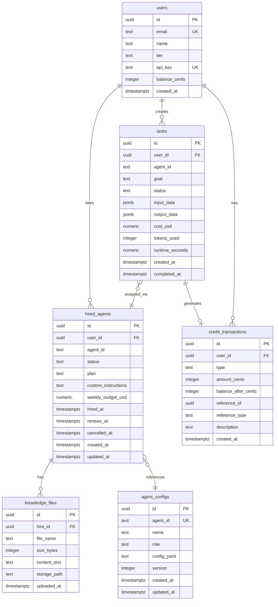

# Database Detailed Design

Scoped to **Agent Hiring**, **Agent Settings**, and **Knowledge Files** features.
Extends existing schema in `infra/init.sql`.

---

## 1. ER Diagram



---

## 2. New Table Definitions

### E-01: Hired Agents (`hired_agents`)

Tracks the relationship between a user and an agent they hired. One user can hire multiple agents. An agent can be hired by multiple users.

| Column | Type | Constraints | Description |
|--------|------|-------------|-------------|
| id | UUID | PK, DEFAULT gen_random_uuid() | Unique hire ID |
| user_id | UUID | FK → users(id) ON DELETE CASCADE, NOT NULL | Hiring user |
| agent_id | TEXT | NOT NULL | Agent config ID (e.g. "coder") |
| status | TEXT | NOT NULL, DEFAULT 'active' | active, renewing_soon, cancelled, expired |
| plan | TEXT | NOT NULL, DEFAULT 'solo' | Pricing plan name |
| custom_instructions | TEXT | | User-defined system prompt for agent |
| weekly_budget_usd | NUMERIC(10,2) | NOT NULL, DEFAULT 100.00 | Weekly spending cap |
| hired_at | TIMESTAMPTZ | NOT NULL, DEFAULT now() | When hire started |
| renews_at | TIMESTAMPTZ | | Next renewal date |
| cancelled_at | TIMESTAMPTZ | | When cancellation was requested |
| created_at | TIMESTAMPTZ | NOT NULL, DEFAULT now() | Record creation |
| updated_at | TIMESTAMPTZ | NOT NULL, DEFAULT now() | Last modification |

**Indexes:**
- `UNIQUE (user_id, agent_id) WHERE status IN ('active', 'renewing_soon')` — prevent duplicate active hires
- `idx_hired_agents_user` on `(user_id, status)`
- `idx_hired_agents_agent` on `(agent_id)`

**Constraints:**
- `CHECK (status IN ('active', 'renewing_soon', 'cancelled', 'expired'))`

---

### E-02: Knowledge Files (`knowledge_files`)

Markdown files uploaded as agent memory/context. Linked to a specific hire (user-agent pair), not globally to the agent.

| Column | Type | Constraints | Description |
|--------|------|-------------|-------------|
| id | UUID | PK, DEFAULT gen_random_uuid() | Unique file ID |
| hire_id | UUID | FK → hired_agents(id) ON DELETE CASCADE, NOT NULL | Parent hire |
| file_name | TEXT | NOT NULL | Original filename (e.g. "code-standards.md") |
| size_bytes | INTEGER | NOT NULL | File size |
| content_text | TEXT | NOT NULL | Full markdown content (for LLM context injection) |
| storage_path | TEXT | | Optional path to file on disk/blob storage |
| uploaded_at | TIMESTAMPTZ | NOT NULL, DEFAULT now() | Upload timestamp |

**Indexes:**
- `idx_knowledge_files_hire` on `(hire_id)`

**Constraints:**
- `CHECK (size_bytes > 0 AND size_bytes <= 5242880)` — max 5 MB

---

### E-03: Credit Transactions (`credit_transactions`)

Audit log for all credit movements. Every balance change creates a transaction record for traceability.

| Column | Type | Constraints | Description |
|--------|------|-------------|-------------|
| id | UUID | PK, DEFAULT gen_random_uuid() | Unique transaction ID |
| user_id | UUID | FK → users(id) ON DELETE CASCADE, NOT NULL | Account owner |
| type | TEXT | NOT NULL | topup, deduction, refund, signup_bonus |
| amount_cents | INTEGER | NOT NULL | Positive for topup/refund/bonus, negative for deduction |
| balance_after_cents | INTEGER | NOT NULL | Running balance after this transaction |
| reference_id | UUID | | task_id for deductions, stripe_session_id for topups |
| reference_type | TEXT | | task, stripe_checkout, system |
| description | TEXT | NOT NULL | Human-readable: "Task: Fix auth bug — Sonnet 4.6", "Topup $25.00" |
| created_at | TIMESTAMPTZ | NOT NULL, DEFAULT now() | Transaction timestamp |

**Indexes:**
- `idx_credit_transactions_user` on `(user_id, created_at DESC)` — transaction history
- `idx_credit_transactions_ref` on `(reference_id)` WHERE reference_id IS NOT NULL — lookup by task/payment

**Constraints:**
- `CHECK (type IN ('topup', 'deduction', 'refund', 'signup_bonus'))`
- `CHECK ((type = 'deduction' AND amount_cents < 0) OR (type != 'deduction' AND amount_cents > 0))`

---

## 3. Modified Tables

### users (add balance_cents)

Add credit balance column. Stored as integer cents to avoid floating-point issues.

| Column | Type | Constraints | Description |
|--------|------|-------------|-------------|
| balance_cents | INTEGER | NOT NULL, DEFAULT 0 | Credit balance in cents ($1.00 = 100) |

---

### hired_agents (deprecate subscription fields)

The `plan` and `weekly_budget_usd` columns are no longer used in the credit-based billing model. Hiring is now free — agents are added to the user's team at no cost. Cost is per-task.

- `plan` — deprecated, retained for backward compatibility
- `weekly_budget_usd` — deprecated, retained for backward compatibility

---

### tasks (add hire_id reference)

Add optional `hire_id` column to link tasks to the specific hire context. This enables querying "tasks for this hired agent" and injecting the hire's custom_instructions at execution time.

| Column | Type | Constraints | Description |
|--------|------|-------------|-------------|
| hire_id | UUID | FK → hired_agents(id) ON DELETE SET NULL | Which hire context |

**New index:** `idx_tasks_hire` on `(hire_id, created_at DESC)`

---

## 4. SQL Migration

```sql
-- hired_agents
CREATE TABLE IF NOT EXISTS hired_agents (
    id UUID PRIMARY KEY DEFAULT gen_random_uuid(),
    user_id UUID NOT NULL REFERENCES users(id) ON DELETE CASCADE,
    agent_id TEXT NOT NULL,
    status TEXT NOT NULL DEFAULT 'active'
        CHECK (status IN ('active', 'renewing_soon', 'cancelled', 'expired')),
    plan TEXT NOT NULL DEFAULT 'solo',
    custom_instructions TEXT,
    weekly_budget_usd NUMERIC(10, 2) NOT NULL DEFAULT 100.00,
    hired_at TIMESTAMPTZ NOT NULL DEFAULT now(),
    renews_at TIMESTAMPTZ,
    cancelled_at TIMESTAMPTZ,
    created_at TIMESTAMPTZ NOT NULL DEFAULT now(),
    updated_at TIMESTAMPTZ NOT NULL DEFAULT now()
);

CREATE UNIQUE INDEX IF NOT EXISTS idx_hired_agents_unique_active
    ON hired_agents(user_id, agent_id) WHERE status IN ('active', 'renewing_soon');
CREATE INDEX IF NOT EXISTS idx_hired_agents_user ON hired_agents(user_id, status);
CREATE INDEX IF NOT EXISTS idx_hired_agents_agent ON hired_agents(agent_id);

-- knowledge_files
CREATE TABLE IF NOT EXISTS knowledge_files (
    id UUID PRIMARY KEY DEFAULT gen_random_uuid(),
    hire_id UUID NOT NULL REFERENCES hired_agents(id) ON DELETE CASCADE,
    file_name TEXT NOT NULL,
    size_bytes INTEGER NOT NULL CHECK (size_bytes > 0 AND size_bytes <= 5242880),
    content_text TEXT NOT NULL,
    storage_path TEXT,
    uploaded_at TIMESTAMPTZ NOT NULL DEFAULT now()
);

CREATE INDEX IF NOT EXISTS idx_knowledge_files_hire ON knowledge_files(hire_id);

-- tasks: add hire_id
ALTER TABLE tasks ADD COLUMN IF NOT EXISTS hire_id UUID REFERENCES hired_agents(id) ON DELETE SET NULL;
CREATE INDEX IF NOT EXISTS idx_tasks_hire ON tasks(hire_id, created_at DESC);

-- credit_transactions
CREATE TABLE IF NOT EXISTS credit_transactions (
    id UUID PRIMARY KEY DEFAULT gen_random_uuid(),
    user_id UUID NOT NULL REFERENCES users(id) ON DELETE CASCADE,
    type TEXT NOT NULL CHECK (type IN ('topup', 'deduction', 'refund', 'signup_bonus')),
    amount_cents INTEGER NOT NULL,
    balance_after_cents INTEGER NOT NULL,
    reference_id UUID,
    reference_type TEXT,
    description TEXT NOT NULL,
    created_at TIMESTAMPTZ NOT NULL DEFAULT now(),
    CHECK ((type = 'deduction' AND amount_cents < 0) OR (type != 'deduction' AND amount_cents > 0))
);

CREATE INDEX IF NOT EXISTS idx_credit_transactions_user ON credit_transactions(user_id, created_at DESC);
CREATE INDEX IF NOT EXISTS idx_credit_transactions_ref ON credit_transactions(reference_id) WHERE reference_id IS NOT NULL;

-- users: add balance
ALTER TABLE users ADD COLUMN IF NOT EXISTS balance_cents INTEGER NOT NULL DEFAULT 0;
```

---

## 5. Pydantic Models (backend/database/models.py additions)

```python
class HiredAgentRecord(BaseModel):
    id: str
    user_id: str
    agent_id: str
    status: str  # active | renewing_soon | cancelled | expired
    plan: str
    custom_instructions: str | None
    weekly_budget_usd: float
    hired_at: datetime
    renews_at: datetime | None
    cancelled_at: datetime | None
    created_at: datetime
    updated_at: datetime

class KnowledgeFileRecord(BaseModel):
    id: str
    hire_id: str
    file_name: str
    size_bytes: int
    content_text: str
    storage_path: str | None
    uploaded_at: datetime

class CreditTransactionRecord(BaseModel):
    id: str
    user_id: str
    type: str  # topup | deduction | refund | signup_bonus
    amount_cents: int
    balance_after_cents: int
    reference_id: str | None
    reference_type: str | None
    description: str
    created_at: datetime
```

---

## 6. Query Patterns

### List hired agents with stats (S-07)
```sql
SELECT
    ha.*,
    ac.name AS agent_name,
    ac.role AS agent_role,
    COUNT(t.id) AS total_tasks,
    AVG(t.cost_usd) FILTER (WHERE t.status = 'completed') AS avg_cost,
    COUNT(t.id) FILTER (WHERE t.status = 'completed')::float
        / NULLIF(COUNT(t.id), 0) * 100 AS success_rate,
    (SELECT COUNT(*) FROM knowledge_files kf WHERE kf.hire_id = ha.id) AS knowledge_file_count
FROM hired_agents ha
JOIN agent_configs ac ON ac.agent_id = ha.agent_id
LEFT JOIN tasks t ON t.hire_id = ha.id
WHERE ha.user_id = $1
GROUP BY ha.id, ac.name, ac.role
ORDER BY ha.hired_at DESC;
```

### Agent stats with daily breakdown (S-08)
```sql
-- Daily task counts for last 7 days
SELECT
    DATE(t.created_at) AS day,
    COUNT(*) AS task_count
FROM tasks t
WHERE t.hire_id = $1
    AND t.created_at >= NOW() - INTERVAL '7 days'
GROUP BY DATE(t.created_at)
ORDER BY day;

-- Cost breakdown (approximated from task metadata)
SELECT
    SUM(cost_usd) AS total_spent,
    AVG(cost_usd) AS avg_cost,
    AVG(runtime_seconds) AS avg_runtime,
    COUNT(*) FILTER (WHERE status = 'completed') AS completed,
    COUNT(*) FILTER (WHERE status = 'failed') AS failed,
    COUNT(*) FILTER (WHERE status = 'running') AS running,
    COUNT(*) FILTER (WHERE status = 'queued') AS queued
FROM tasks
WHERE hire_id = $1;
```

### Inject knowledge at task execution time
```sql
SELECT content_text
FROM knowledge_files
WHERE hire_id = $1
ORDER BY uploaded_at;
```
Concatenated and prepended to task context along with `custom_instructions`.

### Credit balance check (pre-flight)
```sql
SELECT balance_cents FROM users WHERE id = $1 FOR UPDATE;
```

### Deduct credits (atomic)
```sql
WITH updated AS (
    UPDATE users SET balance_cents = balance_cents - $2
    WHERE id = $1 AND balance_cents >= $2
    RETURNING balance_cents
)
INSERT INTO credit_transactions (user_id, type, amount_cents, balance_after_cents, reference_id, reference_type, description)
SELECT $1, 'deduction', -$2, balance_cents, $3, 'task', $4
FROM updated;
```

### Transaction history
```sql
SELECT * FROM credit_transactions
WHERE user_id = $1
ORDER BY created_at DESC
LIMIT $2 OFFSET $3;
```

### Usage breakdown by agent (billing dashboard)
```sql
SELECT
    t.agent_id,
    ac.name AS agent_name,
    COUNT(*) AS task_count,
    SUM(t.cost_usd) AS total_spent_usd
FROM tasks t
JOIN agent_configs ac ON ac.agent_id = t.agent_id
WHERE t.user_id = $1
    AND t.created_at >= NOW() - INTERVAL '30 days'
GROUP BY t.agent_id, ac.name
ORDER BY total_spent_usd DESC;
```

---

## 7. Traceability

| Entity | Table | Features | Screens |
|--------|-------|----------|---------|
| E-01 Hired Agents | hired_agents | FR-02, FR-03, FR-06, FR-07 | S-07, S-08 |
| E-02 Knowledge Files | knowledge_files | FR-05 | S-07, S-08 |
| E-03 Credit Transactions | credit_transactions | billing | billing dashboard |
| E-04 Tasks (extended) | tasks + hire_id | FR-04 | S-08 |
| E-05 Agent Configs | agent_configs (existing) | FR-01 | S-01, S-02 |
| E-06 Users | users (existing) | All | All |

---

## 8. Data Flow: Task Execution with Knowledge

```
User creates task via S-03
  → POST /api/tasks { agent_id, goal, context }
  → API resolves hire_id from (user_id, agent_id)
  → Fetches custom_instructions + knowledge_files for hire_id
  → Prepends to task context:
      "[INSTRUCTIONS]\n{custom_instructions}\n\n[KNOWLEDGE]\n{file1}\n{file2}\n\n[TASK]\n{goal}"
  → Stores task with hire_id
  → Enqueues Celery job
  → Agent executes with enriched context
```
