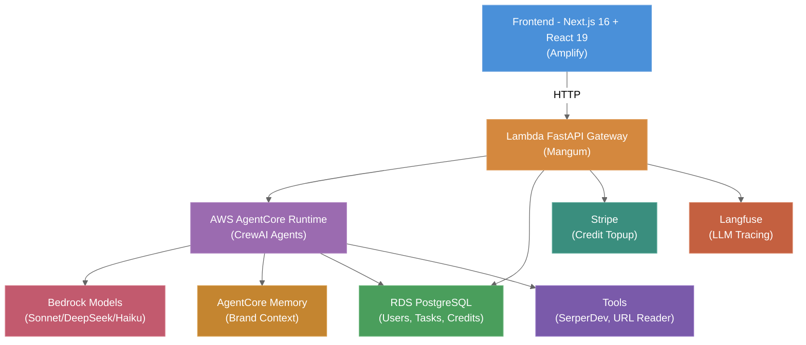
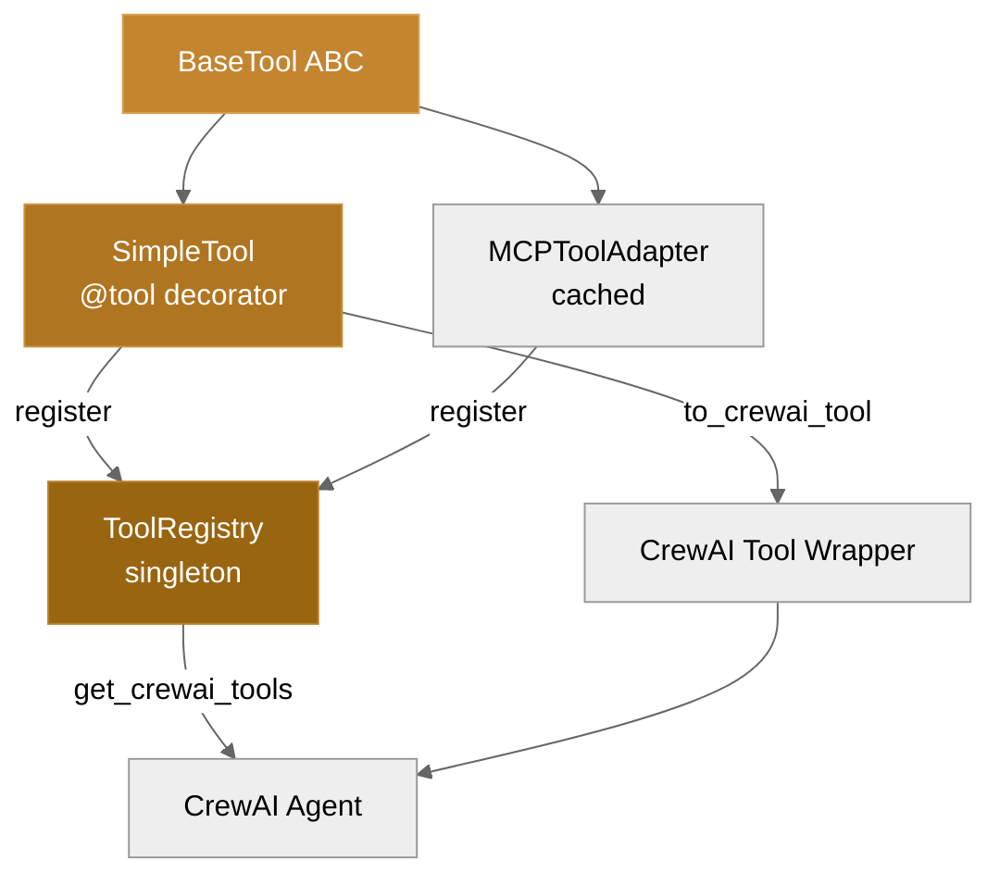
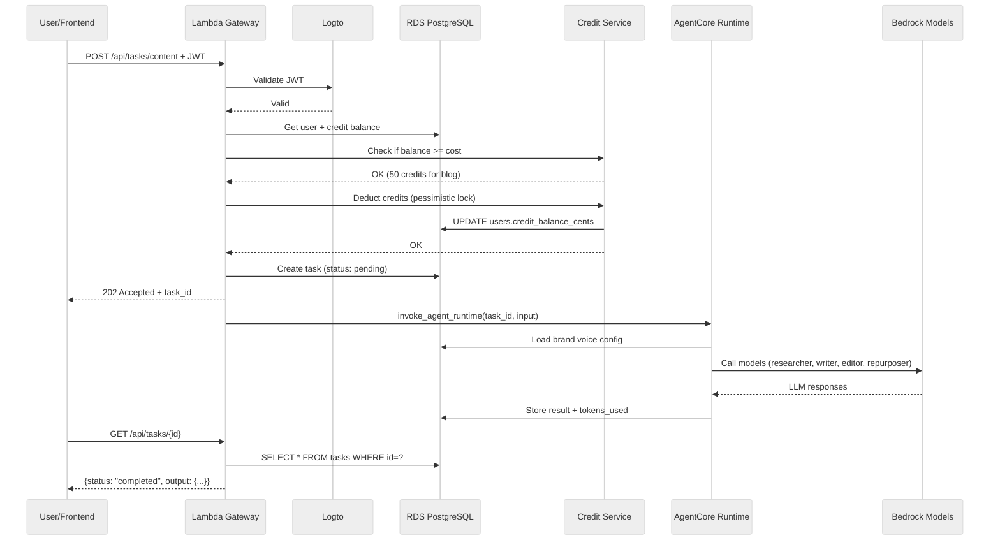
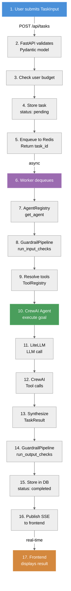
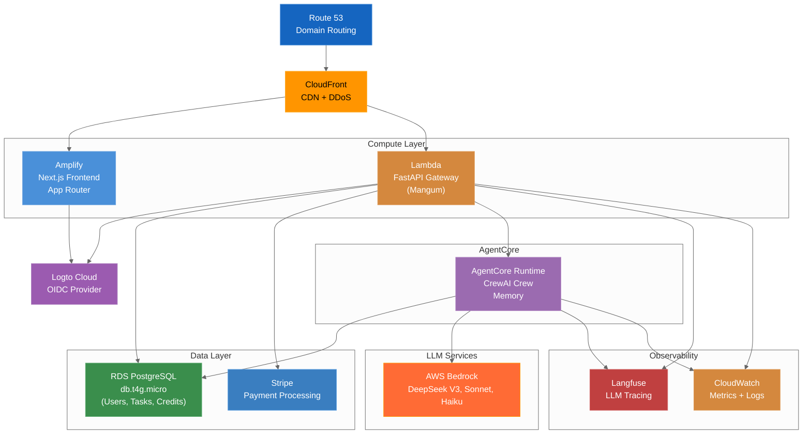

# System Architecture

## Overview

Agent-foundry is a distributed system separating **deterministic flow** (routing, orchestration, validation) from **stochastic intelligence** (LLM reasoning within guardrails). The architecture enables agents to compose into workflows while maintaining cost control, auditability, and safety.

---

## High-Level Architecture



---

## Core Components

### 1. API Gateway (Lambda FastAPI + Mangum)
**Purpose:** Route requests, validate auth, invoke AgentCore, manage credits

**Responsibilities:**
- Logto Cloud OIDC authentication (JWT validation)
- Request validation (Pydantic)
- Credit balance checking & deduction
- Task creation + AgentCore invocation via boto3
- Credit topup (Stripe webhook integration)
- Response marshalling
- Error handling & transformation

**Key Routes:**
- `GET /api/agents` → List available agents (Content Editor)
- `GET /api/users/me` → Authenticated user profile + credit balance
- `POST /api/tasks/content` → Create content task, deduct credits, invoke AgentCore (202 Accepted)
- `GET /api/tasks/{id}` → Task status + result
- `GET /api/tasks` → List user's tasks (paginated)
- `POST /api/credits/topup` → Create Stripe Checkout session
- `POST /api/credits/webhook` → Stripe webhook for credit topup completion

**Auth Flow:**
1. Frontend redirects user to Logto sign-in
2. Logto returns user to frontend with auth code
3. Frontend obtains JWT access token from Logto
4. Subsequent API requests include Bearer JWT token
5. Lambda validates token signature via PyJWKClient (cached)

**Infrastructure:** AWS Lambda with Function URL, Mangum ASGI adapter, 512MB memory, 5-minute timeout, runs in same VPC as RDS

---

### 2. AgentCore Runtime (AWS Bedrock AgentCore)
**Purpose:** Execute CrewAI agents with managed Bedrock LLM access

**Responsibilities:**
- Host Content Editor CrewAI crew (5 sequential agents)
- Manage LLM invocations via native Bedrock integration
- Provide memory persistence across invocations
- Tool execution (SerperDev, URL reader)
- Monitoring + observability (OpenTelemetry)
- Cost tracking per invocation

**Architecture:**
- **Content Editor Crew:** Sequential pipeline (researcher → writer → editor → repurposer)
- **LLM Routing:** DeepSeek V3 (cheap reasoning), Sonnet (writing quality), Haiku (fast scoring)
- **Memory:** AgentCore Memory with brand voice context persistence
- **Tools:** SerperDev for web search, custom URL reader for research

**Data Flow:**
```
TaskInput (topic, brand_config_id)
  ↓
Load brand voice from RDS
  ↓
Retrieve brand context from AgentCore Memory
  ↓
Content Editor Crew executes 5 agents sequentially
  ├─ Researcher: Find sources (SerperDev)
  ├─ Writer: Draft content (Sonnet)
  ├─ Editor: Refine + brand voice (DeepSeek)
  └─ Repurposer: Create variants (DeepSeek)
  ↓
Quality scoring via LLM-as-Judge (Haiku)
  ↓
Store session summary in AgentCore Memory
  ↓
Return ContentOutput (markdown + metadata + variants)
```

---

### 3. Content Editor Agent (CrewAI Crew in AgentCore)
**Purpose:** Multi-agent content generation with brand voice consistency

**Agent Anatomy:**
| Agent | Role | Model | Tools |
|-------|------|-------|-------|
| **Researcher** | Find sources, competitor insights | DeepSeek V3 | SerperDev, URL reader |
| **Writer** | Craft engaging content | Sonnet | None (receives research) |
| **Editor** | Ensure brand voice, grammar, SEO | DeepSeek V3 | None |
| **Repurposer** | Create social + email variants | DeepSeek V3 | None |
| **Quality Judge** | Score content (clarity, accuracy, brand) | Haiku | None |

**Pydantic Models (Content Editor):**
- `ContentTaskInput` — topic, content_type, brand_config_id, target_word_count, keywords, competitor_urls
- `ContentOutput` — title, slug, meta_description, content (markdown), keywords, quality_score, social_variants, cost_usd
- `BrandVoiceConfig` — name, core_values, tone, audience, avoid_words, sentence_length_avg (loaded from RDS)
- `QualityScore` — clarity, data_accuracy, brand_voice, seo_optimization, engagement, weighted_total
- `SocialVariant` — platform (LinkedIn/Twitter/Instagram), content, character_count

**Crew Flow:**
```
Input: topic="10 Productivity Tips", brand_config_id="b2b-saas"
  ↓ Load brand voice from RDS
  ↓ Task 1: Research — Find 5+ sources (SerperDev)
  ↓ Task 2: Outline — Structure with brand voice
  ↓ Task 3: Draft — Write full blog post (Sonnet)
  ↓ Task 4: Edit — Refine for brand, SEO
  ↓ Task 5: Repurpose — Create 5 social + 2 email variants
  ↓ Quality Judge: Score each dimension
  ↓
Output: ContentOutput with markdown + variants + score
```

**Tools (Content Editor):**
- **SerperDev:** Web search for research + competitor analysis
- **URL Reader:** Extract content from URLs for source processing
- **LLM-as-Judge:** Haiku for quality scoring with rubric

**Tool System (Legacy - Future Agents):**



---

### 4. Task Execution (Lambda → AgentCore)
**Purpose:** Coordinate task execution via Lambda, manage credits, persist results

**Responsibilities:**
- Validate Logto JWT + user authentication
- Check user credit balance
- Deduct credits optimistically (refund on failure)
- Create task record in RDS (status: pending)
- Invoke AgentCore Runtime asynchronously (boto3)
- Poll task completion (up to 5 minutes)
- Store result + cost in RDS
- Publish to frontend (polling-based, not SSE)

**Task Execution Flow:**



---

### 5. Data & Memory Systems

#### 5a. RDS PostgreSQL (Structured Data)
**Tables:**
- `users` — id, logto_id, email, credit_balance_cents, created_at, updated_at
- `brand_configs` — id, user_id, name, voice_yaml (YAML), created_at, updated_at
- `content_tasks` — id, user_id, brand_config_id, task_type, status, input_json, output_json, tokens_used, cost_cents, created_at, completed_at
- `credit_transactions` — id, user_id, amount_cents, type (topup/deduction/refund), task_id, description, created_at

**Indexes:**
- `(user_id, created_at DESC)` on content_tasks (user's task history)
- `(user_id)` on brand_configs (user's brands)
- `(status)` on content_tasks (find pending tasks)

#### 5b. AgentCore Memory (Brand Context Persistence)
**Purpose:** Store brand voice configurations + session summaries across AgentCore invocations

**Data:**
- Brand voice preferences (tone, values, audience, keywords)
- Session summaries (content type, quality score, feedback)
- Learning insights (what worked, what didn't)

**Workflow:**
1. Task starts: retrieve `/brand/{user_id}/` memories from AgentCore Memory
2. Inject brand context into researcher + writer agent prompts
3. Task completes: store quality score + content summary
4. Next task for same user retrieves improved context

**Example:**
```python
from bedrock_agentcore.memory import MemoryClient

client = MemoryClient(region_name='us-east-1', memory_id=MEMORY_ID)

# Retrieve past brand context
memories = client.retrieve_memories(
    namespace=f'/brand/{user_id}/',
    query='brand preferences and writing tone'
)

# Store session learning
client.add_memory(
    namespace=f'/brand/{user_id}/',
    description=f'Blog post quality: {score.weighted_total:.2f}',
    memory_type='SessionSummary'
)
```

#### 5c. Stripe (Billing + Credit Topup)
**Purpose:** Payment processing for credit purchases

**Integration:**
- Webhook validates credit topup completion
- Stripe test mode for development
- 3 fixed packages: $10 → 1000 credits, $25 → 2750 credits, $50 → 6000 credits

---

### 6. Cost Control & Billing

**Credit System (MVP):**
- Signup: +$5.00 free credit
- Blog post: 50 credits ($0.50) — actual cost ~$0.30–0.50
- Credit topup: Stripe packages ($10, $25, $50 with bonuses)
- All costs tracked in `credit_transactions` table

**Cost Per Blog Post Breakdown:**
- DeepSeek V3 research: ~$0.05
- Sonnet writing: ~$0.25
- DeepSeek V3 editing: ~$0.05
- Haiku quality scoring: ~$0.02
- **Total: ~$0.37 per blog** (2x markup = 50 credits = $0.50)

**Cost Monitoring:**
- CloudWatch metrics: tokens/day, cost/day per user
- Langfuse dashboard: cost breakdown by model, agent, user
- Alarms: Daily spend > $20 (alert via SNS)

**Billing Flow:**
```
User submits task
  ↓
Check balance >= cost (50 credits)
  ↓
Deduct optimistically (pessimistic lock to prevent race)
  ↓
AgentCore executes
  ↓
Verify actual cost (usually lower than deduction)
  ↓
Store final cost in task record
  ↓
If refund needed: credit back difference
```

---

### 7. Bedrock LLM Routing (AWS Native)

**Purpose:** Cost-optimized access to Claude, DeepSeek via AWS Bedrock

**Strategy:**
- **Research (Cheap):** DeepSeek V3 — factual extraction, web search analysis
- **Writing (Quality):** Claude Sonnet 3.5 — high-quality prose, brand voice adherence
- **Editing (Cheap):** DeepSeek V3 — rule-following, brand voice enforcement
- **Repurposing (Cheap):** DeepSeek V3 — template adaptation, social post generation
- **Quality Judge (Fast):** Claude Haiku 3.5 — structured scoring, quick feedback

**Bedrock Model IDs (CrewAI):**
```python
from crewai import LLM

researcher_llm = LLM(model="bedrock/us.deepseek.r1-v1:0")
writer_llm = LLM(model="bedrock/anthropic.claude-3-5-sonnet-20241022-v2:0")
editor_llm = LLM(model="bedrock/us.deepseek.r1-v1:0")
repurposer_llm = LLM(model="bedrock/us.deepseek.r1-v1:0")
judge_llm = LLM(model="bedrock/anthropic.claude-3-5-haiku-20241022-v1:0")
```

**Cost Comparison (per 1M tokens):**
| Model | Input | Output |
|-------|-------|--------|
| DeepSeek V3 | $0.27 | $1.10 |
| Claude Haiku | $0.25 | $1.25 |
| Claude Sonnet | $3.00 | $15.00 |

---

### 8. Observability & Tracing

#### Langfuse (LLM Tracing)
Captures Bedrock LLM calls, agent execution traces, token usage, and costs. Provides dashboard for cost tracking per agent, per user, per model.

**Integration:**
- AgentCore exports OpenTelemetry traces to Langfuse
- Each LLM call tracked: model, input/output tokens, latency, cost
- Full crew trace shows: researcher (1.5min) → writer (2min) → editor (1min) → repurposer (1min) → judge (0.3min)
- Cost breakdown per model: DeepSeek vs Sonnet vs Haiku actual usage

#### CloudWatch Metrics
- Lambda invocations, errors, duration (API Gateway)
- AgentCore vCPU-hours consumed
- RDS connections, CPU utilization
- Daily spend tracking (aggregate Bedrock costs)

#### Application Logs
- Structured JSON: timestamp, level (DEBUG/INFO/ERROR), component, user_id, task_id, cost_cents
- Log retention: 30 days (cost control)

---

## Data Flow: Task Execution

**Request-Response Sequence:**



**Key Data Structures in Flow:**

| Stage | Structure | Details |
|-------|-----------|---------|
| Input | `TaskInput` | agent_id, goal, context, budget_usd, timeout_seconds, metadata |
| Config | `AgentConfig` | Loaded from YAML (base.yaml with inheritance) |
| Execution | `CrewAI Agent` | role, goal, backstory, llm, tools, memory |
| Output | `TaskResult` | status, output, error, tokens_used, cost_usd, duration_seconds |
| Guardrails | `GuardrailConfig` | max_budget_usd, max_runtime_seconds, output_schema, block_prompt_injection |

---

## Deployment Topology (AWS)



**Infrastructure Breakdown:**
- **Amplify Hosting:** Next.js frontend, auto-deploys from GitHub, $0.15/GB served
- **Lambda + Function URL:** FastAPI gateway, 512MB memory, 5min timeout, pays per invocation + GB-seconds
- **AgentCore Runtime:** Managed agent execution, ~$0.0895/vCPU-hr, auto-scales
- **RDS PostgreSQL:** db.t4g.micro, ~$15/month, single-AZ for MVP
- **Logto Cloud:** Managed OIDC, free tier sufficient for MVP
- **Langfuse:** Self-hosted or cloud (optional for MVP, use CloudWatch logs as fallback)
- **CloudWatch:** Included with Lambda/RDS, 30-day log retention

**Scaling:**
- Lambda: Auto-scales on concurrency (default 100), ~1-2s cold start
- AgentCore: Pay-per-use, scales with vCPU demand
- RDS: Single-AZ for dev, upgrade to multi-AZ for production
- Frontend: Amplify auto-scales, CDN caches static assets

**Cost Estimate (Monthly at Beta Scale 5–10 users):**
- Bedrock models: $50–150 (token usage)
- AgentCore Runtime: $20–50 (vCPU-hours)
- Lambda: $5–15 (free tier covers 1M invocations)
- RDS: $15–20
- Amplify: $5–10
- CloudFront: $2–5
- **Total: $97–250/month** (well under $500 constraint)

---

## Phase Rollout

**AWS AgentCore Migration (March 2026):**

**Phase 1 — AWS Foundation + CDK Setup (COMPLETE)**
- [x] AWS account + Bedrock model access enabled (DeepSeek V3, Sonnet, Haiku)
- [x] CDK project scaffolded (infra/cdk/, stacks: FoundationStack + AgentCoreStack)
- [x] VPC + RDS PostgreSQL (db.t4g.micro) + Secrets Manager
- [x] AgentCore Runtime + Memory configured
- [x] RDS schema: users, brand_configs, content_tasks, credit_transactions
- [x] Makefile updated with CDK + agentcore commands

**Phase 2 — Content Editor Agent (COMPLETE)**
- [x] CrewAI crew with 4 agents: researcher, writer, editor, repurposer
- [x] Models: DeepSeek V3 (cheap), Sonnet (writing), Haiku (scoring)
- [x] Tools: SerperDev search, URL reader for research
- [x] Brand voice loader from RDS
- [x] Quality scorer (LLM-as-Judge with rubric)
- [x] AgentCore Memory integration for brand context
- [x] Local testing with `agentcore dev`
- [x] Deployed to AgentCore Runtime

**Phase 3 — API Gateway + Auth (COMPLETE)**
- [x] Lambda FastAPI gateway with Mangum adapter
- [x] Logto JWT validation
- [x] Content task endpoints: POST /api/tasks/content, GET /api/tasks/{id}
- [x] Credit system: check balance, deduct, refund, topup
- [x] Stripe integration for credit packages
- [x] boto3 AgentCore invoker service
- [x] CDK Lambda stack with Function URL

**Phase 4 — Frontend Migration (COMPLETE)**
- [x] Content Editor task form component (topic, brand config, keywords)
- [x] Content result display with markdown rendering
- [x] Credit balance badge + topup packages
- [x] Task history list
- [x] Sidebar nav: Content Editor + Credits
- [x] Amplify deployment config
- [x] TanStack Query hooks for content + credits APIs

**Phase 5 — Testing + Launch Prep (In Progress)**
- [ ] Unit tests: Pydantic models, credit service, brand voice loader
- [ ] Integration tests: full content flow, credit deduction + refund
- [ ] Langfuse integration for LLM trace visibility
- [ ] CloudWatch dashboards (operations, cost tracking)
- [ ] Docs update: system-architecture.md, code-standards.md
- [ ] Beta user setup + sample brand configs
- [ ] Performance baseline (10 blog posts)
- [ ] Cost monitoring + alarms

**Future Phases (Post-MVP):**
- Phase 6: Social Media Manager agent
- Phase 7: Email Campaign Builder agent
- Phase 8: Scale to 50+ paid customers
- Phase 9: White-label packaging + Public API

---

## Document Metadata
- **Version:** 2.0 (AWS AgentCore Migration)
- **Last Updated:** 2026-03-16
- **Owner:** Architecture Team
- **Status:** AWS Migration Complete (Phases 1–4)
  - Phase 1: CDK + Foundation Stack deployed
  - Phase 2: Content Editor agent deployed to AgentCore
  - Phase 3: Lambda API gateway + credit system deployed
  - Phase 4: Frontend + Amplify deployed
  - Phase 5: Testing + launch prep in progress
