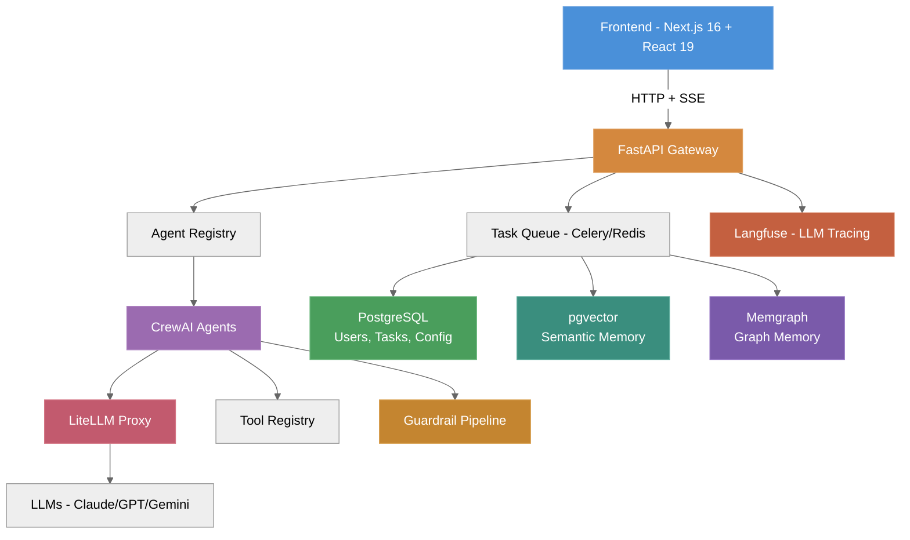
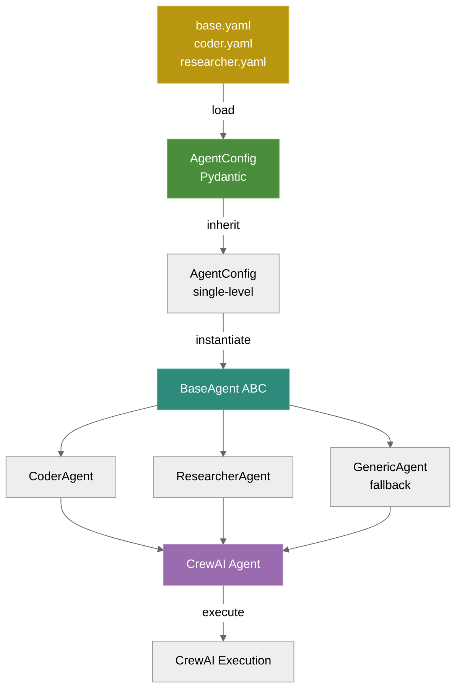
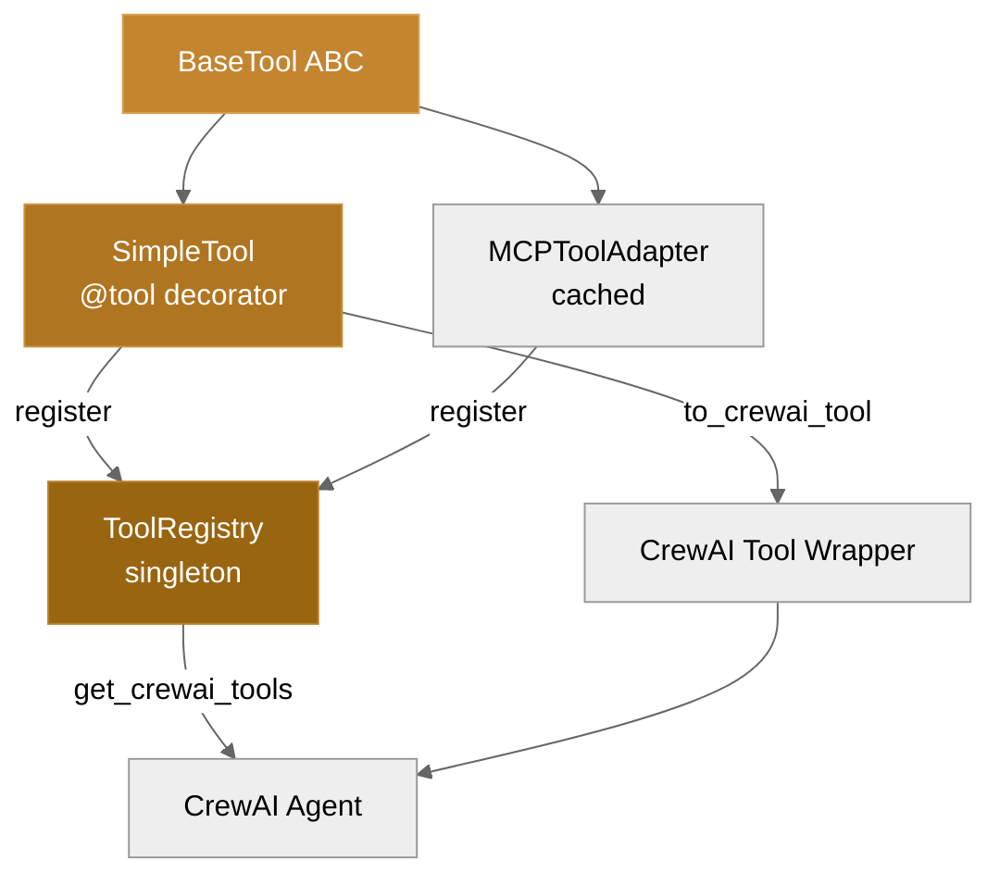
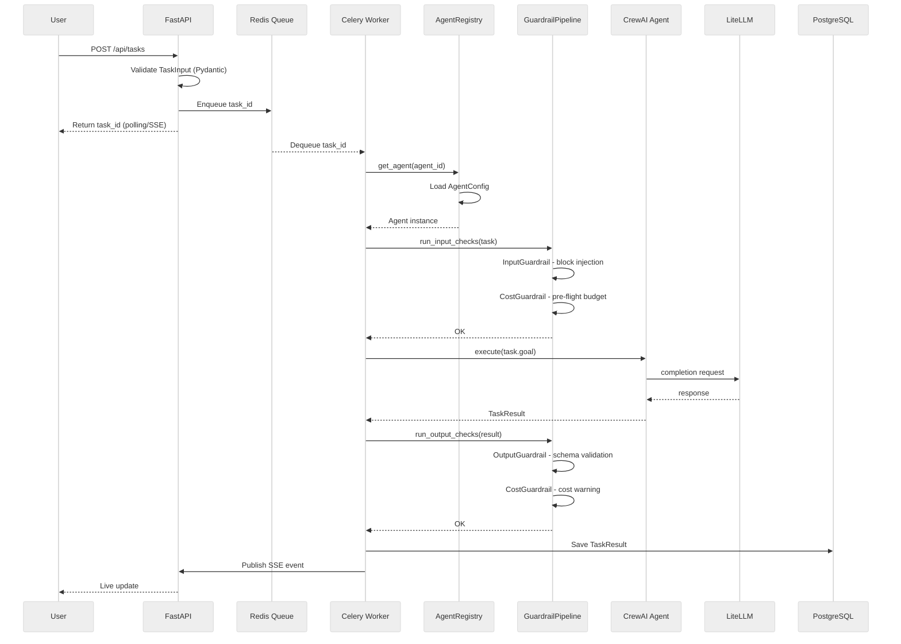
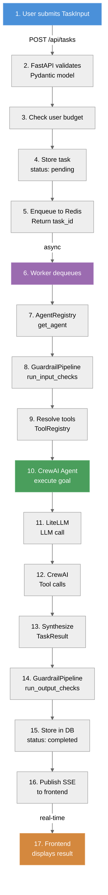
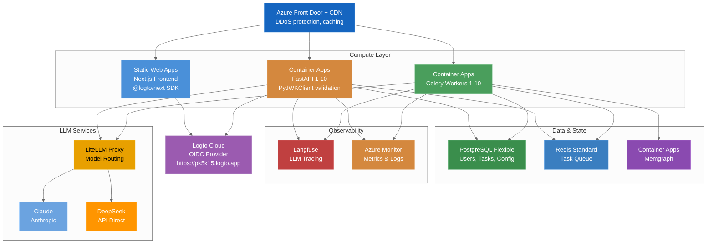

# System Architecture

## Overview

Agent-foundry is a distributed system separating **deterministic flow** (routing, orchestration, validation) from **stochastic intelligence** (LLM reasoning within guardrails). The architecture enables agents to compose into workflows while maintaining cost control, auditability, and safety.

---

## High-Level Architecture



---

## Core Components

### 1. API Gateway (FastAPI)
**Purpose:** Route requests, validate auth, mediate between frontend and workers

**Responsibilities:**
- Logto Cloud OIDC authentication (JWT + PyJWKClient validation)
- API key-based authentication (for service-to-service)
- Request validation (Pydantic)
- Rate limiting & quota enforcement (per API key)
- Response marshalling
- SSE connection for live task monitoring
- Error handling & transformation
- Optional MOCK_AUTH bypass for development

**Key Routes:**
- `GET /health` → Service health check
- `GET /agents` → List agents with filters
- `GET /agents/{agent_id}` → Agent public profile
- `POST /agents/{agent_id}/hire` → Hire an agent (weekly subscription)
- `GET /agents/hired` → List user's hired agents (My Team)
- `GET /agents/hired/{hire_id}` → Hired agent detail + stats
- `PUT /agents/hired/{hire_id}/settings` → Update custom instructions
- `DELETE /agents/hired/{hire_id}` → Cancel hire
- `POST /agents/hired/{hire_id}/rehire` → Reactivate cancelled hire
- `POST /agents/hired/{hire_id}/knowledge` → Upload knowledge file
- `DELETE /agents/hired/{hire_id}/knowledge/{file_id}` → Delete knowledge file
- `GET /agents/hired/{hire_id}/tasks` → Recent tasks for hired agent
- `POST /tasks` → Create task, enqueue (with optional hire_id for context injection)
- `GET /tasks/{id}` → Task status & results
- `GET /tasks/{id}/stream` → SSE live updates
- `GET /users/me` → Authenticated user profile
- `POST /auth/callback` → Logto OIDC callback
- `GET /subscriptions` → User's current tier (future)

**Auth Flow:**
1. Frontend redirects user to Logto sign-in (`/auth/signin`)
2. Logto returns user to callback endpoint (`/auth/callback`)
3. Backend validates Logto token via JWKS endpoint
4. JWT stored in secure HTTP-only cookie (NextAuth.js)
5. Subsequent requests include JWT token
6. Backend validates token signature + expiry via PyJWKClient

**Infrastructure:** Uvicorn ASGI server, runs in Container Apps

---

### 2. Task Orchestrator (CrewAI / LangGraph)
**Purpose:** Coordinate multi-agent workflows, route tasks to agents

**Responsibilities:**
- Parse task input (goal, context, constraints)
- Route to correct agent(s) based on task type
- Handle sequential pipelines (A → B → C)
- Handle parallel execution (A, B, C concurrently)
- Aggregate results for hierarchical workflows (Manager → Specialists)
- Time-box execution (< 5min SLA)
- Error recovery (retry logic, fallback agents)

**Architecture:**
- **CrewAI Manager:** For multi-agent coordination within a task
- **LangGraph:** For complex workflows spanning multiple tasks/agents
- Both share same agent interface (Pydantic TaskInput → TaskResult)

**Data Flow:**
```
TaskInput
  ↓
[Orchestrator determines agent(s)]
  ↓
[Parallel or Sequential Dispatch]
  ↓
[Collect Results]
  ↓
TaskResult (aggregated output)
```

---

### 3. Agent Framework
**Purpose:** Define agent behavior, integrate LLM + tools, enforce guardrails

**Agent Anatomy:**
| Layer | Implementation |
|-------|-----------------|
| **Identity** | YAML config (id, name, role, goal, backstory, version) |
| **Brain** | LLM via LiteLLM (Claude Sonnet, GPT-4o, Gemini, etc.) |
| **Tools** | BaseTool ABC + @tool decorator (SimpleTool) / MCPToolAdapter |
| **Memory** | Short-term (session) + pgai semantic search + Memgraph relationships |
| **Guardrails** | Input/Output validation, cost limits, prompt injection detection |
| **I/O Contract** | TaskInput → TaskResult (Pydantic) |

**Agent Framework Architecture:**



**Pydantic Models (config.py):**
- `AgentConfig` — Full agent configuration (id, name, role, goal, llm, tools, guardrails)
- `LLMConfig` — LLM provider routing (model, base_url, temperature, max_tokens)
- `TaskInput` — Task contract (agent_id, goal, context, budget_usd, timeout_seconds)
- `TaskResult` — Result contract (status, output, error, tokens_used, cost_usd, duration_seconds)
- `GuardrailConfig` — Safety limits (max_budget_usd, max_runtime_seconds, output_schema)
- `ToolConfig` — Tool configuration (name, enabled, config dict)

**Tool System:**



**Pre-built Tools (via @tool decorator):**
- Web search, file I/O, code interpretation
- GitHub MCP integration (planned Phase 2)
- Notion MCP integration (planned Phase 2)

---

### 4. Task Executor (Celery Workers)
**Purpose:** Execute tasks asynchronously, manage job queue, handle retries

**Responsibilities:**
- Dequeue tasks from Redis
- Instantiate agent from AgentRegistry
- Run GuardrailPipeline.run_input_checks() (prompt injection, budget)
- Invoke CrewAI Agent with resolved tools
- Capture output, logs, metrics from CrewAI
- Run GuardrailPipeline.run_output_checks() (schema validation, cost warning)
- Store result in PostgreSQL
- Publish completion events (Langfuse, SSE)
- Retry on transient failures (exponential backoff)
- Hard timeout (300s default from GuardrailConfig.max_runtime_seconds)

**Task Execution Flow:**



---

### 5. Memory & Knowledge Subsystem

#### 5a. PostgreSQL (Structured Data)
**Tables:**
- `users` — Account, tier, API key
- `subscriptions` — Current tier, renewal date, price
- `tasks` — User id, agent, goal, input, output, cost, timestamps, hire_id (for hired agents context)
- `tasks_history` — Archive of completed tasks
- `agents_config` — YAML agent definitions (versioned)
- `hired_agents` — User-agent subscription (status, plan, custom_instructions, weekly_budget_usd, renewal dates)
- `knowledge_files` — Markdown files uploaded for hired agents (content_text for context injection)
- `tools` — Available tools, pricing
- `invoices` — Billing records
- `audit_log` — API calls, agent runs, sensitive actions

**Indexes:**
- `(user_id, created_at)` on tasks (filter by user, sort by time)
- `(agent_id, status)` on tasks (filter by agent, find pending)
- `(user_id, created_at DESC)` on audit_log

#### 5b. pgai (Semantic Memory + RAG)
**Purpose:** Enable agents to search for similar past tasks, documents, examples

**Data:**
- Session transcripts (agent reasoning + output)
- User-uploaded context documents (PDFs, markdown)
- Past task outputs (code, reports, designs)
- Knowledge base (team wiki, brand guidelines, coding standards)

**Workflow:**
1. User uploads context doc or task completes
2. Text split into chunks (max 2K tokens)
3. pgai auto-vectorises via embedding API (OpenAI default, or local Ollama)
4. Stored in `pgvector` column with metadata (task_id, agent_id, user_id, type)
5. Agent retrieves similar chunks via semantic search: "Find past coder tasks with error handling patterns"
6. Chunks injected into agent prompt as context

**Example Query:**
```sql
SELECT chunk_text, similarity
FROM knowledge_embeddings
WHERE user_id = $1 AND type = 'task_output'
ORDER BY embedding <-> pgvector::vector($2)  -- cosine similarity
LIMIT 5;
```

#### 5c. Memgraph (Relational Graph)
**Purpose:** Track agent-task relationships and enable analytics (Phase 2+ evaluation).

**Status:** Stub implementation — not fully integrated yet. Evaluation in Phase 2 will determine if graph queries add value over PostgreSQL + pgai.

**Planned Usage:** Agent success metrics, workflow recommendations, skill overlap analysis.

---

### 6. Guardrails & Cost Control

**Guardrail Pipeline Architecture:**

```mermaid
%%{init: {'theme': 'neutral'}}%%
graph LR
    IN["TaskInput"]
    IGR["InputGuardrail<br/>prompt injection"]
    CGR1["CostGuardrail<br/>pre-flight budget"]
    EX["Execute<br/>CrewAI Agent"]
    CGR2["CostGuardrail<br/>cost warning"]
    OGR["OutputGuardrail<br/>schema validation"]
    OUT["TaskResult"]

    IN -->|validate| IGR
    IGR -->|check| CGR1
    CGR1 -->|approved| EX
    EX -->|result| CGR2
    CGR2 -->|check| OGR
    OGR -->|valid| OUT

    style IGR fill:#c25a5a,stroke:#d47575,color:#fff
    style CGR1 fill:#b8960f,stroke:#d4b030,color:#fff
    style CGR2 fill:#b8960f,stroke:#d4b030,color:#fff
    style OGR fill:#4a9e5c,stroke:#6db87e,color:#fff
```



**Guardrail Implementation (guardrails/ module):**

| Class | Responsibility |
|-------|-----------------|
| `GuardrailBase` | Abstract base with async validate_input/validate_output methods |
| `GuardrailPipeline` | Composes multiple guardrails, runs in sequence |
| `InputGuardrail` | Detects prompt injection patterns, validates required fields |
| `CostGuardrail` | Pre-flight budget check, cost forecasting, warns if approaching limit |
| `OutputGuardrail` | Validates TaskResult schema, checks token count |

**Cost Control (via GuardrailConfig):**
- Per-task budget: `max_budget_usd = 10.0` (default, per config)
- Per-agent max runtime: `max_runtime_seconds = 300` (5 minutes)
- Output schema validation: `output_schema = "TaskResult"` (enforced)
- Prompt injection detection: `block_prompt_injection = True` (default)

**Exception Hierarchy (exceptions.py):**
```
AgentError (base)
├── AgentConfigError → Invalid config
├── AgentExecutionError → Task failed
├── AgentNotFoundError → Agent not in registry
├── ToolNotFoundError → Tool not in registry
└── GuardrailViolation (base)
    ├── BudgetExceededError → Budget limit exceeded
    ├── OutputValidationError → Result schema invalid
    └── InputValidationError → Prompt injection detected
```

---

### 7. LLM Routing (LiteLLM + OpenRouter + DeepSeek)

**Purpose:** One API key, 200+ models, cost-based automatic routing

**Strategy:**
- **Primary (reasoning):** Claude Sonnet 4.6 for complex tasks
- **Code:** DeepSeek-Coder or Claude for coding tasks
- **Chat:** DeepSeek-Chat for conversational tasks
- **Reasoning:** DeepSeek-Reasoner for multi-step problems
- **Fast/cheap:** Claude Haiku or Gemini Flash for simple tasks
- **Fallback:** If quota exceeded, downgrade to cheaper model
- **On-device:** Ollama for low-latency, cost-free execution (local)

**DeepSeek Models (Direct API):**
- `deepseek-coder` — Code generation, debugging, refactoring
- `deepseek-chat` — General conversation, summarization
- `deepseek-reasoner` — Complex reasoning, multi-step problems

**Configuration:**
```python
agent_llm_config = {
    "coder": {
        "primary": "claude-4.6-sonnet",
        "fallback": ["claude-3.5-sonnet", "gpt-4o", "ollama/neural-chat"],
        "budget": 50.0,  # max $ per day
    },
    "research": {
        "primary": "claude-haiku",
        "fallback": ["gemini-2.0-flash"],
        "budget": 20.0,
    }
}
```

**Via LiteLLM:**
```python
import litellm

response = litellm.completion(
    model="openrouter/claude-3.5-sonnet",
    messages=[...],
    budget_limit_dollars=10.0,
)
```

---

### 8. Observability & Tracing

#### Langfuse (LLM Tracing)
Captures LLM calls, agent execution traces, task lifecycle, and cost breakdowns. Enables cost tracking per agent per user.

#### Observability
- **OpenTelemetry:** API latency, error rates, queue depth, worker utilization
- **Azure Monitor:** Metrics, logs, performance counters
- **Application Logs:** Structured JSON with timestamp, level, service, agent_id, task_id, user_id

---

## Data Flow: Task Execution

**Request-Response Sequence:**



**Key Data Structures in Flow:**

| Stage | Structure | Details |
|-------|-----------|---------|
| Input | `TaskInput` | agent_id, goal, context, budget_usd, timeout_seconds, metadata |
| Config | `AgentConfig` | Loaded from YAML (base.yaml with inheritance) |
| Execution | `CrewAI Agent` | role, goal, backstory, llm, tools, memory |
| Output | `TaskResult` | status, output, error, tokens_used, cost_usd, duration_seconds |
| Guardrails | `GuardrailConfig` | max_budget_usd, max_runtime_seconds, output_schema, block_prompt_injection |

---

## Deployment Topology (Azure)



**Infrastructure Breakdown:**
- **Azure Front Door:** Global routing, DDoS protection, request rate limiting
- **Static Web Apps:** Next.js frontend (auto-scaling, free tier eligible)
- **Container Apps:** FastAPI + Celery (scale based on CPU/memory + queue depth)
- **PostgreSQL Flexible:** Pay-per-use, auto-pause when idle, backups
- **Redis:** Standard tier (1GB sufficient for MVP queue)
- **Memgraph:** Single instance in Container Apps (evaluate Phase 3)
- **Logto Cloud:** Managed OIDC auth provider (no self-hosting required)
- **LiteLLM Proxy:** Model routing + fallback logic (local Container Apps)

**Scaling:**
- FastAPI: Container Apps (1-10 instances based on CPU/memory)
- Celery workers: Container Apps (1-10 instances based on queue depth)
- PostgreSQL: Auto-pause after inactivity; scale storage as data grows
- Redis: Standard tier (1GB, sufficient for MVP queue)
- Memgraph: Container Apps (single instance, evaluate after Phase 2)

**Cost Estimate:** $210–240 AUD/month infrastructure
- Container Apps: $30–50 (auto-scale to zero)
- PostgreSQL: $50–70
- Redis: $15–20
- Static Web Apps: Free
- Front Door: $30–40

---

## Phase Rollout

**Phase 1 (Weeks 1–4):**

**Week 1 — Foundation (COMPLETE)**
- Agent interface contract: `TaskInput`, `TaskResult` Pydantic models
- Base `Agent` ABC + concrete stubs (Coder, Research)
- FastAPI scaffolding with routers (health, agents, tasks)
- Docker Compose stack: Traefik, PostgreSQL, Redis, Memgraph, LiteLLM, Langfuse
- Makefile with development commands
- .env.example template
- Next.js 16 frontend skeleton (layout + landing page)

**Weeks 2–4 (COMPLETE)**
- [x] Agent framework: tools, guardrails, config loader, exception hierarchy
- [x] Coder + Research agent implementations (with tools, LLM invocation ready)
- [x] PostgreSQL migrations + pgai semantic setup
- [x] Celery worker implementation (task execution, retries, progress publishing)
- [x] API endpoint implementations (health, agents, tasks with SSE)
- [ ] GitHub Actions CI/CD (pending Phase 2)

**Phase 2 (Weeks 5–8) — COMPLETE:**
- [x] PM, QA, Copywriter agents added (5 agents total)
- [x] Orchestrator (CrewAI manager) keyword-based routing
- [x] Frontend marketplace UI + auth (Logto Cloud)
- [x] Billing dashboard UI
- [x] Notion + GitHub MCP integrated
- [x] Internal dogfood testing with agents
- [x] Hired agents feature (weekly subscriptions, My Team page, agent detail view, knowledge upload, custom instructions)

**Phase 3 (Weeks 9–14):**
- Image + Video agents
- Memgraph evaluation (keep or remove?)
- Public signup + Stripe billing
- 50+ paid customers

**Phase 4 (Weeks 15+):**
- White-label packaging
- Public API + SDKs
- Agent versioning & A/B testing
- Scale to 500+ users

---

## Document Metadata
- **Version:** 1.4
- **Last Updated:** 2026-03-15
- **Owner:** Architecture Team
- **Status:** Phase 1–2, 6–11 Complete (All 9 backend modules + hired agents routers + auth + CI/CD + Phase 11 frontend UI + hired agents pages implemented; Logto Cloud auth integrated; Knowledge injection into tasks implemented)
