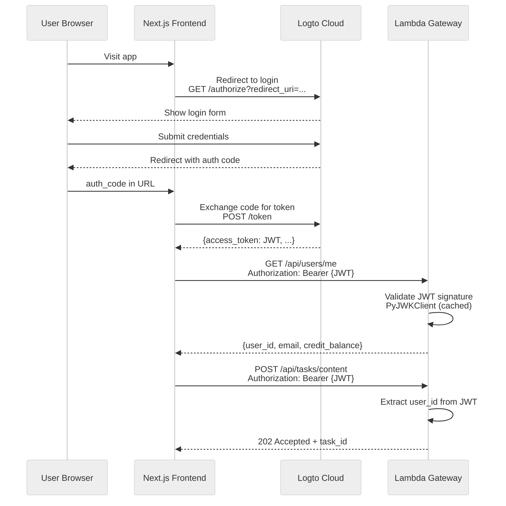
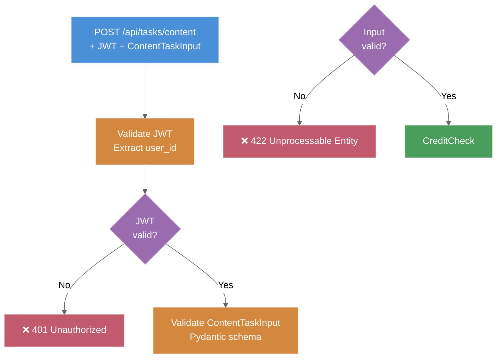
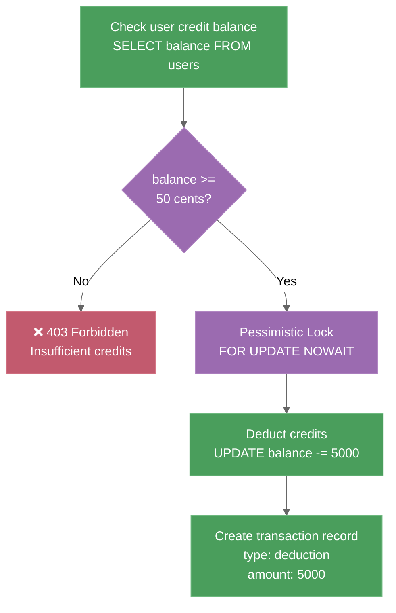
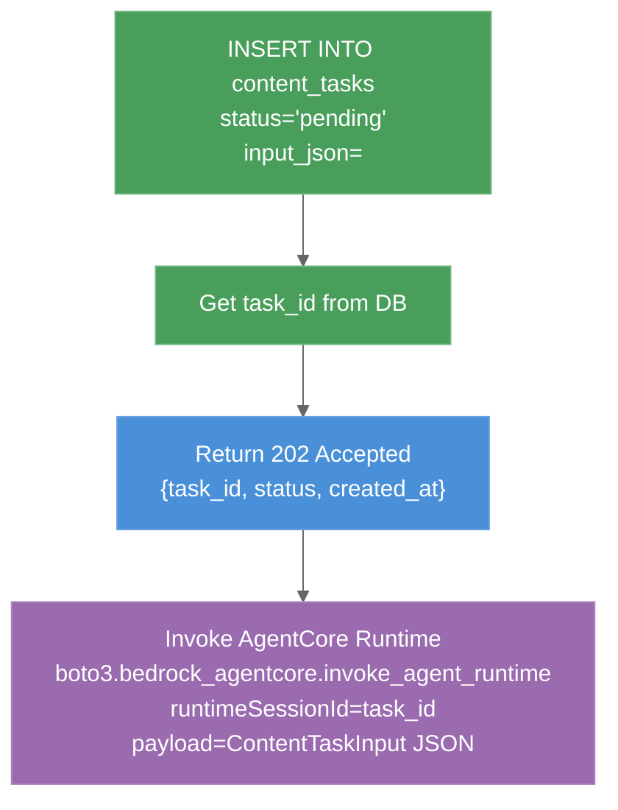
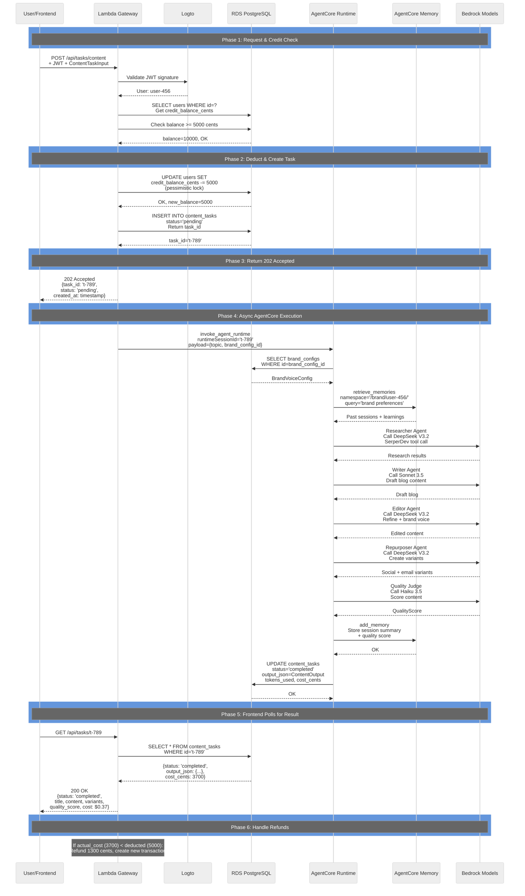

# API Gateway & Task Execution

## Lambda FastAPI Gateway

The API Gateway is a Lambda function running FastAPI with Mangum adapter. It handles request routing, authentication, credit management, and AgentCore invocation.

**Infrastructure:**
- Runtime: Python 3.12
- Memory: 512MB
- Timeout: 5 minutes
- Architecture: ARM64 (Graviton)
- VPC: Same VPC as RDS (private subnet)
- Endpoint: Function URL (HTTPS)

---

## Authentication Flow (Logto JWT)



**Key Components:**
- **PyJWKClient:** Caches Logto's JWKS (public keys) to avoid repeated network calls
- **JWT Claims:** Extract `sub` (user ID), `email` from token
- **Token Expiry:** Validate `exp` claim; frontend handles refresh

---

## Task Execution Flow (Async)

### Phase 1: Request & Auth



### Phase 2: Credit Check & Deduction



### Phase 3: Create Task & Invoke AgentCore



---

## Complete Task Execution Sequence



---

## Credit System (Pessimistic Locking)

### Why Pessimistic Locking?
- Prevents race conditions when multiple tasks are submitted simultaneously
- Ensures accurate balance tracking
- Example: User has 100 cents, submits 2 tasks of 60 cents each — pessimistic lock ensures one task is rejected

### Implementation
```python
async with db.begin():
    # Lock for UPDATE prevents other transactions from reading this row
    user = await db.execute(
        "SELECT * FROM users WHERE id = ? FOR UPDATE NOWAIT",
        [user_id]
    )

    if user.credit_balance_cents < cost_cents:
        raise InsufficientCreditsError()

    # Deduct optimistically
    new_balance = user.credit_balance_cents - cost_cents
    await db.execute(
        "UPDATE users SET credit_balance_cents = ? WHERE id = ?",
        [new_balance, user_id]
    )

    # Create transaction record
    await db.execute(
        "INSERT INTO credit_transactions (user_id, amount_cents, type) VALUES (?, ?, ?)",
        [user_id, -cost_cents, 'deduction']
    )
```

### Refund Logic
After AgentCore execution:
1. Measure actual LLM token usage
2. Calculate actual cost (usually lower than estimate)
3. If `actual_cost < deducted_cost`: refund difference
4. Create separate transaction record for refund

---

## Polling Pattern (No SSE)

Frontend uses polling to check task status:

```javascript
// frontend/lib/hooks/useTasks.ts
export function useTaskById(taskId: string) {
  const queryClient = useQueryClient();

  return useQuery({
    queryKey: ['tasks', taskId],
    queryFn: async () => {
      const response = await fetch(`/api/tasks/${taskId}`, {
        headers: { 'Authorization': `Bearer ${token}` }
      });
      return response.json();
    },
    // Poll every 2 seconds while status is 'pending'
    refetchInterval: (data) => data?.status === 'pending' ? 2000 : false,
    // Stop after 5 minutes
    gcTime: 300_000
  });
}
```

---

## Error Handling

| HTTP Status | Scenario | Response |
|------------|----------|----------|
| 200 | Task completed | `{status: 'completed', output: {...}, cost: 0.37}` |
| 202 | Task accepted (async) | `{status: 'pending', task_id: '...', created_at: '...'}` |
| 400 | Malformed request | `{error: 'Invalid input', details: {...}}` |
| 401 | Invalid/expired JWT | `{error: 'Unauthorized', message: 'Invalid token'}` |
| 403 | Insufficient credits | `{error: 'Forbidden', message: 'Insufficient credits'}` |
| 404 | Task not found | `{error: 'Not found', message: 'Task t-789 not found'}` |
| 422 | Validation error | `{error: 'Validation error', details: {...}}` |
| 500 | AgentCore execution failure | `{error: 'Internal error', task_id: '...'}` (task marked as failed) |

---

## Code Locations

- **Main app:** `backend/gateway/main.py` (FastAPI setup, lifespan, middleware)
- **Routers:** `backend/gateway/routers/` (content_tasks.py, users.py, credits.py, agents.py)
- **Auth:** `backend/gateway/auth/logto_jwt.py`, `dependencies.py`
- **Services:** `backend/gateway/services/` (agentcore_invoker.py, credit_service.py, task_service.py)
- **Models:** `backend/gateway/models/` (api_models.py, db_models.py)

---

## Document Metadata

- **Version:** 2.0
- **Last Updated:** 2026-03-16
- **Owner:** Backend Architecture Team
