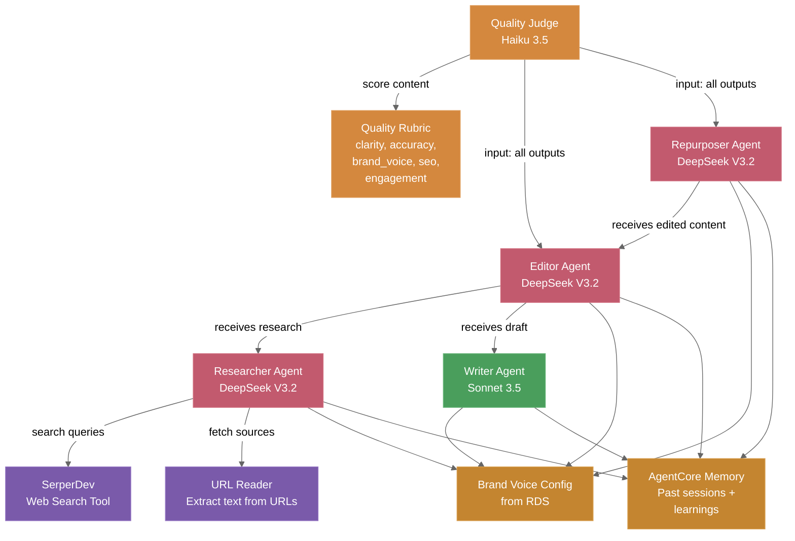

# Content Editor Agent Flow

## Agent Anatomy

The Content Editor is a CrewAI crew with 4 sequential agents + a quality judge:

| Agent | Role | Model | Tools | Purpose |
|-------|------|-------|-------|---------|
| **Researcher** | Find sources | DeepSeek V3 | SerperDev, URL reader | Locate credible sources, extract key facts |
| **Writer** | Craft content | Sonnet 3.5 | None (receives research) | Draft engaging, on-brand content |
| **Editor** | Refine | DeepSeek V3 | None | Brand voice consistency, SEO, grammar |
| **Repurposer** | Create variants | DeepSeek V3 | None | Social posts (LinkedIn/Twitter/Instagram), email |
| **Quality Judge** | Score output | Haiku 3.5 | None | Evaluate clarity, accuracy, brand fit, SEO, engagement |

---

## Pydantic Models

### Input: ContentTaskInput
```python
class ContentTaskInput(BaseModel):
    topic: str                      # "10 Productivity Tips"
    content_type: str               # "blog" | "email" | "social"
    brand_config_id: str            # Links to BrandVoiceConfig
    target_word_count: int = 2000   # For blog posts
    keywords: list[str] = []        # SEO keywords
    competitor_urls: list[str] = [] # For research reference
```

### Data: BrandVoiceConfig
```python
class BrandVoiceConfig(BaseModel):
    name: str                       # "B2B SaaS"
    core_values: list[str]          # ["transparency", "innovation"]
    tone: str                        # "professional but friendly"
    audience: str                    # "engineering managers"
    avoid_words: list[str]          # ["enterprise", "leverage"]
    sentence_length_avg: int = 18   # Average words per sentence
```

### Scoring: QualityScore
```python
class QualityScore(BaseModel):
    clarity: float                  # 0.0-1.0
    data_accuracy: float            # 0.0-1.0
    brand_voice: float              # 0.0-1.0
    seo_optimization: float         # 0.0-1.0
    engagement: float               # 0.0-1.0
    weighted_total: float           # Average of above
```

### Output: ContentOutput
```python
class ContentOutput(BaseModel):
    title: str                      # "How to Boost Productivity"
    slug: str                        # "how-to-boost-productivity"
    meta_description: str           # SEO meta tag
    content: str                     # Full markdown content
    keywords: list[str]             # Extracted + verified keywords
    quality_score: QualityScore     # Scoring breakdown
    social_variants: list[SocialVariant]  # LinkedIn, Twitter, Instagram
    email_variant: EmailVariant     # Email version
    cost_usd: float                 # Actual token cost
```

### Variants
```python
class SocialVariant(BaseModel):
    platform: str                   # "LinkedIn" | "Twitter" | "Instagram"
    content: str                    # Optimized for platform
    character_count: int            # Length for platform

class EmailVariant(BaseModel):
    subject: str                    # Email subject line
    body: str                        # Email body
    cta: str                         # Call-to-action
```

---

## Crew Data Flow (Sequential Pipeline)

```mermaid
%%{init: {'theme': 'neutral'}}%%
graph TD
    Start["1. TaskInput<br/>topic=&quot;10 Productivity Tips&quot;<br/>brand_config_id=&quot;b2b-saas&quot;"]
    LoadBrand["2. Load BrandVoiceConfig<br/>from RDS"]
    RetrieveMem["3. Retrieve AgentCore Memory<br/>Brand context + past learnings"]
    Researcher["4. Researcher Agent<br/>DeepSeek V3.2<br/>SerperDev + URL reader"]
    ResearchOutput["Research Output<br/>5+ sources + summaries"]
    Writer["5. Writer Agent<br/>Claude Sonnet<br/>Draft blog post"]
    WriterOutput["Draft Blog<br/>2000 words markdown"]
    Editor["6. Editor Agent<br/>DeepSeek V3.2<br/>Brand voice + SEO check"]
    EditorOutput["Edited Blog<br/>Grammar, tone, SEO"]
    Repurposer["7. Repurposer Agent<br/>DeepSeek V3.2<br/>5 social + 2 email variants"]
    RepurpOutput["Variants<br/>LinkedIn, Twitter, Instagram, Email"]
    Judge["8. Quality Judge<br/>Claude Haiku<br/>LLM-as-Judge scoring"]
    JudgeOutput["QualityScore<br/>clarity, accuracy, brand_voice, seo, engagement"]
    StoreMemory["9. Store Session Summary<br/>in AgentCore Memory"]
    Result["10. Return ContentOutput<br/>markdown + variants + score"]

    Start --> LoadBrand
    LoadBrand --> RetrieveMem
    RetrieveMem --> Researcher
    Researcher --> ResearchOutput
    ResearchOutput --> Writer
    Writer --> WriterOutput
    WriterOutput --> Editor
    Editor --> EditorOutput
    EditorOutput --> Repurposer
    Repurposer --> RepurpOutput
    RepurpOutput --> Judge
    Judge --> JudgeOutput
    JudgeOutput --> StoreMemory
    StoreMemory --> Result

    style Start fill:#4a90d9,stroke:#6ba3e0,color:#fff
    style LoadBrand fill:#9b6bb0,stroke:#b085c2,color:#fff
    style RetrieveMem fill:#c48530,stroke:#d9a050,color:#fff
    style Researcher fill:#c25a6e,stroke:#d47585,color:#fff
    style Writer fill:#4a9e5c,stroke:#6db87e,color:#fff
    style Editor fill:#c25a6e,stroke:#d47585,color:#fff
    style Repurposer fill:#c25a6e,stroke:#d47585,color:#fff
    style Judge fill:#d4883e,stroke:#e0a060,color:#fff
    style StoreMemory fill:#c48530,stroke:#d9a050,color:#fff
    style Result fill:#4a90d9,stroke:#6ba3e0,color:#fff
```



---

## Typical Execution Timeline

| Step | Agent | Model | Time | Cost |
|------|-------|-------|------|------|
| 1 | Researcher | DeepSeek V3 | 90s | $0.08 |
| 2 | Writer | Sonnet | 120s | $0.22 |
| 3 | Editor | DeepSeek V3 | 60s | $0.04 |
| 4 | Repurposer | DeepSeek V3 | 60s | $0.02 |
| 5 | Judge | Haiku | 18s | $0.01 |
| **Total** | — | — | **6min 28s** | **$0.37** |

**Billing:** Charged as 50 credits ($0.50); refund 13 cents if actual cost is lower.

---

## Tools & Agent Integration



### SerperDev (Web Search)
- API for web search results
- Used by Researcher to find credible sources
- Returns top 10 results with snippets

### URL Reader
- Custom tool to extract text from URLs
- Parses HTML, removes noise, extracts main content
- Used by Researcher to process source material

### Quality Rubric (LLM-as-Judge)
**Dimensions scored 0.0–1.0:**
- **Clarity:** Is the content easy to understand?
- **Data Accuracy:** Are facts correct and cited?
- **Brand Voice:** Does it match the brand tone + values?
- **SEO Optimization:** Does it target keywords naturally?
- **Engagement:** Is it compelling and actionable?

---

## AgentCore Memory Integration

### Retrieval (On Task Start)
```python
from bedrock_agentcore.memory import MemoryClient

client = MemoryClient(region_name='us-east-1')

# Retrieve past sessions for this user
memories = client.retrieve_memories(
    memory_id=MEMORY_ID,
    namespace=f'/brand/{user_id}/',
    query='brand preferences and writing tone'
)

# Inject into agent prompts
brand_context = memories[0]['text'] if memories else ""
```

### Storage (On Task Completion)
```python
# Store session learning
client.add_memory(
    memory_id=MEMORY_ID,
    namespace=f'/brand/{user_id}/',
    description=f'Blog post quality: {score.weighted_total:.2f}, avg sentence: 18 words',
    memory_type='SessionSummary'
)
```

### Learning Loop
1. **First task:** Brand context loaded from RDS BrandVoiceConfig
2. **Tasks 2+:** AgentCore Memory provides refined context based on past sessions
3. **Continuous improvement:** Quality scores guide memory updates; high-quality sessions inform future prompts

---

## Code Locations

- **Crew definition:** `backend/agentcore/crews/content_crew.py`
- **Agent implementations:** `backend/agentcore/agents/content_*.py` (researcher, writer, editor, repurposer)
- **Tools:** `backend/agentcore/tools/` (web_search.py, url_reader.py)
- **Models:** `backend/agentcore/models/` (ContentTaskInput, ContentOutput, BrandVoiceConfig, QualityScore)
- **Config:** `backend/agentcore/config/agent_configs.yaml`, `backend/agentcore/config/quality_rubric.yaml`
- **Services:** `backend/agentcore/services/` (brand_voice_loader.py, quality_scorer.py, memory_manager.py)

---

## Document Metadata

- **Version:** 2.0
- **Last Updated:** 2026-03-16
- **Owner:** Agent Architecture Team
