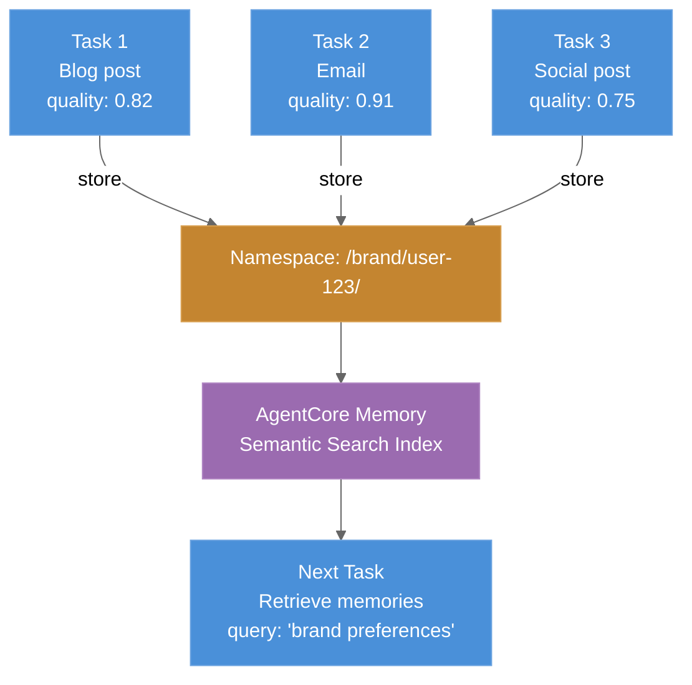
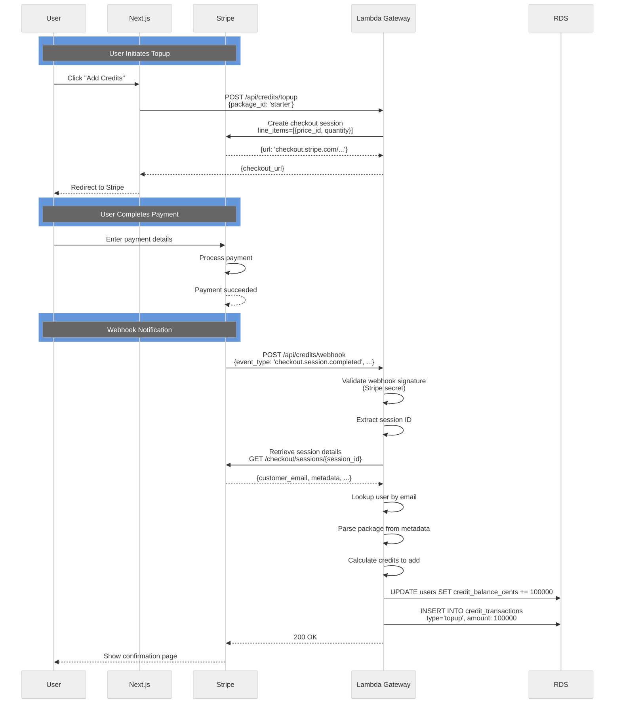
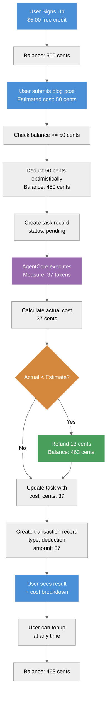

# Data & Memory Systems

## RDS PostgreSQL (Structured Data)

### Schema Overview

```sql
-- Users & Authentication
CREATE TABLE users (
    id UUID PRIMARY KEY,
    logto_id VARCHAR(255) UNIQUE NOT NULL,      -- From Logto
    email VARCHAR(255) UNIQUE NOT NULL,
    credit_balance_cents INT DEFAULT 500,        -- $5.00 free signup
    created_at TIMESTAMP DEFAULT NOW(),
    updated_at TIMESTAMP DEFAULT NOW()
);

-- Brand Voice Configurations
CREATE TABLE brand_configs (
    id UUID PRIMARY KEY,
    user_id UUID NOT NULL REFERENCES users(id),
    name VARCHAR(255),                           -- "B2B SaaS"
    voice_yaml TEXT NOT NULL,                    -- Serialized BrandVoiceConfig
    created_at TIMESTAMP DEFAULT NOW(),
    updated_at TIMESTAMP DEFAULT NOW()
);

-- Content Tasks (Results Storage)
CREATE TABLE content_tasks (
    id UUID PRIMARY KEY,
    user_id UUID NOT NULL REFERENCES users(id),
    brand_config_id UUID REFERENCES brand_configs(id),
    task_type VARCHAR(50),                       -- "blog" | "email" | "social"
    status VARCHAR(50) DEFAULT 'pending',        -- pending, running, completed, failed
    input_json JSONB NOT NULL,                   -- Serialized ContentTaskInput
    output_json JSONB,                           -- Serialized ContentOutput
    tokens_used INT,                             -- Total tokens consumed
    cost_cents INT,                              -- Final cost in cents
    error_message TEXT,                          -- If status='failed'
    created_at TIMESTAMP DEFAULT NOW(),
    completed_at TIMESTAMP,
    updated_at TIMESTAMP DEFAULT NOW()
);

-- Credit Transactions (Audit Trail)
CREATE TABLE credit_transactions (
    id UUID PRIMARY KEY,
    user_id UUID NOT NULL REFERENCES users(id),
    amount_cents INT NOT NULL,                   -- Negative for deduction, positive for topup/refund
    type VARCHAR(50) NOT NULL,                   -- "deduction" | "topup" | "refund"
    task_id UUID REFERENCES content_tasks(id),   -- Which task caused deduction (if any)
    description VARCHAR(500),                    -- Human-readable reason
    created_at TIMESTAMP DEFAULT NOW()
);
```

### Indexes (Performance)

| Index | Purpose |
|-------|---------|
| `(user_id, created_at DESC)` on content_tasks | User's task history (most recent first) |
| `(user_id)` on brand_configs | User's brand configurations |
| `(status)` on content_tasks | Find pending/running tasks |
| `(user_id, created_at DESC)` on credit_transactions | User's billing history |

### Typical Queries

```sql
-- Get user with credit balance
SELECT id, email, credit_balance_cents FROM users WHERE id = ?;

-- Get pending tasks (for monitoring)
SELECT id, user_id, status, created_at FROM content_tasks
WHERE status = 'pending' ORDER BY created_at DESC;

-- Get user's task history
SELECT id, task_type, status, cost_cents, created_at FROM content_tasks
WHERE user_id = ? ORDER BY created_at DESC LIMIT 20;

-- Get credit transaction history (for billing page)
SELECT type, amount_cents, description, created_at FROM credit_transactions
WHERE user_id = ? ORDER BY created_at DESC;

-- Calculate total spent this month
SELECT SUM(ABS(amount_cents)) as total_spent FROM credit_transactions
WHERE user_id = ? AND type = 'deduction' AND created_at >= DATE_TRUNC('month', NOW());
```

---

## AgentCore Memory (Brand Context Persistence)

### Purpose & Design

AgentCore Memory provides **semantic search** + **long-term retention** of brand context across multiple task executions. Unlike RDS (structured data), AgentCore Memory enables learning over time.

**Data stored:**
- Brand voice preferences (tone, values, audience)
- Session summaries (content type, quality score, feedback)
- Learning insights (what content performed well, what didn't)

### Architecture



### Workflow: Store & Retrieve

#### Retrieve (Task Start)
```python
from bedrock_agentcore.memory import MemoryClient

client = MemoryClient(region_name='us-east-1', memory_id=MEMORY_ID)

# Retrieve past sessions for this user
memories = client.retrieve_memories(
    namespace=f'/brand/{user_id}/',
    query='brand voice preferences and writing tone',
    max_results=5
)

# Inject into agent system prompts
if memories:
    brand_context = memories[0]['description']
    # Example: "Previous sessions showed users prefer 18-word avg sentences,
    #           professional but friendly tone, avoid 'leverage'"
else:
    # Fall back to RDS BrandVoiceConfig
    brand_context = load_brand_config_from_rds(brand_config_id)
```

#### Store (Task Completion)
```python
# Store session learning
client.add_memory(
    namespace=f'/brand/{user_id}/',
    description=f'''
    Blog post completed: quality={score.weighted_total:.2f}/1.0
    Clarity: {score.clarity:.2f}, Accuracy: {score.data_accuracy:.2f}
    Brand voice fit: {score.brand_voice:.2f}
    Avg sentence length: {measured_sentence_length} words
    Keywords used: {', '.join(keywords)}
    ''',
    memory_type='SessionSummary'
)
```

### Namespace Organization

Each user gets a namespace hierarchy:

```
/brand/{user_id}/
├── preferences/        # Core brand voice settings
├── session-2024-03-16/ # Date-specific sessions
└── learnings/          # Extracted insights
```

### Query Examples

```python
# Find past blog posts
memories = client.retrieve_memories(
    namespace=f'/brand/{user_id}/',
    query='blog post writing style'
)

# Find high-quality sessions
memories = client.retrieve_memories(
    namespace=f'/brand/{user_id}/',
    query='high quality score clarity accuracy'
)

# Find social media content preferences
memories = client.retrieve_memories(
    namespace=f'/brand/{user_id}/',
    query='linkedin twitter instagram platform-specific tone'
)
```

---

## Stripe Integration (Billing & Credit Topup)

### Credit Packages

| Package | Price | Credits | Cost per Credit |
|---------|-------|---------|-----------------|
| Starter | $10 | 1000 | $0.0100 |
| Growth | $25 | 2750 | $0.0091 |
| Pro | $50 | 6000 | $0.0083 |

### Webhook Flow



### Webhook Implementation

```python
# backend/gateway/routers/credits.py
@router.post("/api/credits/webhook")
async def stripe_webhook(request: Request, db: AsyncSession):
    body = await request.body()
    sig_header = request.headers.get('stripe-signature')

    try:
        event = stripe.Webhook.construct_event(
            body, sig_header, STRIPE_WEBHOOK_SECRET
        )
    except ValueError:
        return {"error": "Invalid signature"}, 400

    if event['type'] == 'checkout.session.completed':
        session = event['data']['object']
        customer_email = session['customer_details']['email']

        # Find user by email
        user = await db.execute(
            "SELECT * FROM users WHERE email = ?", [customer_email]
        )

        # Parse package from metadata
        package_id = session['metadata']['package_id']
        credits_to_add = PACKAGE_CREDITS[package_id]

        # Update balance
        await db.execute(
            "UPDATE users SET credit_balance_cents = credit_balance_cents + ? WHERE id = ?",
            [credits_to_add, user.id]
        )

        # Create transaction record
        await db.execute(
            "INSERT INTO credit_transactions (user_id, amount_cents, type, description) VALUES (?, ?, ?, ?)",
            [user.id, credits_to_add, 'topup', f'Stripe checkout: {package_id}']
        )

    return {"status": "received"}, 200
```

---

## Billing Flow: Complete Lifecycle



---

## Cost Breakdown (Per Task)

### Blog Post Example
| Stage | Model | Tokens (est.) | Cost |
|-------|-------|---------------|------|
| Researcher | DeepSeek V3 | 2000 input, 500 output | $0.081 |
| Writer | Sonnet | 500 input, 1500 output | $0.235 |
| Editor | DeepSeek V3 | 1000 input, 200 output | $0.032 |
| Repurposer | DeepSeek V3 | 800 input, 300 output | $0.020 |
| Judge | Haiku | 1500 input, 50 output | $0.004 |
| **Total** | — | — | **$0.372** |

**Billing:** Charged 50 credits ($0.50); refund 13 cents (13 credits).

---

## Code Locations

- **RDS models:** `backend/database/models.py` (SQLAlchemy ORM)
- **Schema:** `backend/database/migrations/` (Alembic)
- **Memory service:** `backend/agentcore/services/memory_manager.py`
- **Credit service:** `backend/gateway/services/credit_service.py`
- **Task service:** `backend/gateway/services/task_service.py`

---

## Document Metadata

- **Version:** 2.0
- **Last Updated:** 2026-03-16
- **Owner:** Data Architecture Team
