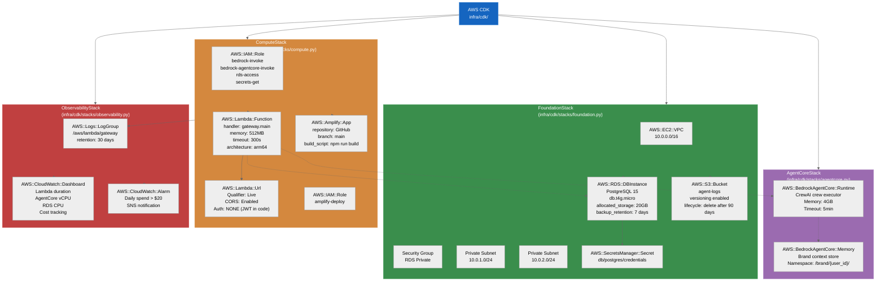
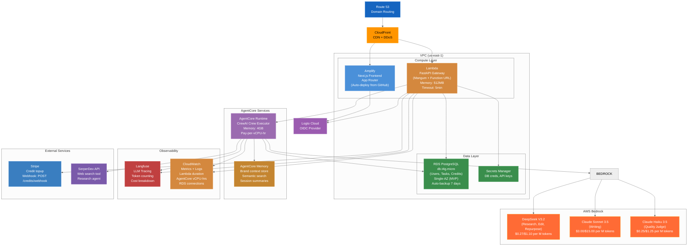

# Deployment & Infrastructure

## AWS CDK Stack Architecture

Agent Foundry is deployed using AWS CDK (Infrastructure as Code) with a modular stack design.



---

## Deployment Topology



---

## Infrastructure Component Details

### Amplify (Frontend Hosting)
- **Deployment:** Auto-deploys from GitHub `main` branch
- **Build command:** `npm run build` (Next.js compilation)
- **Environment:** Automatically sets `NEXT_PUBLIC_*` variables from AWS Amplify console
- **Pricing:** $0.15/GB served + minimal compute charges
- **SSL:** Automatic HTTPS via CloudFront

### Lambda API Gateway
- **Runtime:** Python 3.12 on ARM64 (Graviton processors)
- **Memory:** 512MB (configurable, 128MB–10GB)
- **Timeout:** 5 minutes (300s)
- **Concurrency:** Default 100 concurrent invocations (can be increased)
- **Cold Start:** ~1–2 seconds (warm containers reused)
- **Pricing:** Free tier 1M invocations/month; then $0.0000002 per invocation + $0.0000167 per GB-second

**IAM Permissions:**
```json
{
  "Version": "2012-10-17",
  "Statement": [
    {
      "Effect": "Allow",
      "Action": [
        "bedrock:InvokeModel",
        "bedrock-agentcore:InvokeAgentRuntime"
      ],
      "Resource": "*"
    },
    {
      "Effect": "Allow",
      "Action": ["secretsmanager:GetSecretValue"],
      "Resource": "arn:aws:secretsmanager:us-east-1:*:secret:db/postgres/*"
    },
    {
      "Effect": "Allow",
      "Action": ["logs:CreateLogGroup", "logs:CreateLogStream", "logs:PutLogEvents"],
      "Resource": "arn:aws:logs:us-east-1:*:*"
    }
  ]
}
```

### RDS PostgreSQL
- **Instance class:** db.t4g.micro (1 vCPU, 1GB RAM) for MVP
- **Storage:** 20GB (auto-scaling available)
- **Engine:** PostgreSQL 15
- **Backups:** Automated daily backups, 7-day retention
- **Multi-AZ:** Single-AZ for MVP (upgrade to Multi-AZ for production HA)
- **Pricing:** ~$15–20/month for t4g.micro
- **VPC:** Private subnet; accessed only via Lambda in same VPC
- **Encryption:** At-rest encryption via AWS KMS

### Secrets Manager
- **DB credentials:** username, password, host stored securely
- **API keys:** SerperDev API key, Stripe webhook secret
- **Rotation:** Manual rotation; automatic rotation available (Phase 2+)
- **Pricing:** $0.40/month per secret

### AgentCore Runtime
- **Execution model:** Serverless; pay-per-vCPU-hour
- **Memory:** 4GB (configurable)
- **Timeout:** 5 minutes (configurable)
- **Scaling:** Automatic; no capacity planning needed
- **Cost:** ~$0.0895/vCPU-hour (varies by region)
- **Example:** 10 tasks × 6 min = 1 vCPU-hour/day = ~$0.90/day = ~$27/month

### AgentCore Memory
- **Capacity:** Unlimited (scales automatically)
- **Semantic search:** Vector database for similarity matching
- **Namespace isolation:** Per-user isolation at `/brand/{user_id}/`
- **Cost:** $0.001 per 1000 stored items (approx. $1–5/month for MVP)

### CloudWatch
- **Logs:** Included; 30-day retention
- **Metrics:** Custom metrics for cost tracking
- **Dashboards:** Visualize Lambda duration, AgentCore vCPU usage, RDS CPU
- **Alarms:** Alert on spend > $20/day

---

## Scaling Strategy

### Current (MVP — 5–10 users)
- Lambda: Default concurrency limit (100) is sufficient
- AgentCore: Pay-per-use; no pre-provisioning
- RDS: db.t4g.micro handles ~50 concurrent connections
- Bedrock: API rate limits not an issue at this scale

### Growth (50–100 users)
- **Lambda:** Increase concurrency limit to 500
- **RDS:** Upgrade to db.t4g.small (2 vCPU, 2GB RAM)
- **AgentCore:** Monitor vCPU-hour consumption; may need larger memory allocation per invocation
- **Bedrock:** Implement request batching for token efficiency

### Production (500+ users)
- **Lambda:** Increase to 1000+ concurrency; consider read replicas for high-traffic endpoints
- **RDS:** Multi-AZ deployment with read replicas; consider Aurora PostgreSQL for auto-scaling
- **AgentCore:** Custom provisioning or dedicated capacity
- **Bedrock:** Negotiate volume discounts

---

## Cost Estimate (Monthly at Beta Scale 5–10 users)

| Component | Estimate | Notes |
|-----------|----------|-------|
| **Bedrock Models** | $50–150 | Token usage (DeepSeek + Sonnet + Haiku) |
| **AgentCore Runtime** | $20–50 | vCPU-hours consumption |
| **AgentCore Memory** | $5–10 | Semantic search + storage |
| **Lambda** | $5–15 | Free tier covers 1M invocations |
| **RDS** | $15–20 | db.t4g.micro + storage |
| **Amplify** | $5–10 | Bandwidth + builds |
| **CloudFront** | $2–5 | CDN caching |
| **Secrets Manager** | <$1 | Negligible |
| **CloudWatch** | <$1 | Included in Lambda/RDS |
| **Langfuse** | $0–50 | Optional; free tier available |
| **Stripe** | 2.9% + $0.30/transaction | Payment processing (only on topups) |
| **SerperDev** | $5–20 | Web search API calls (100 free queries/month) |
| **Logto** | $0 | Free tier sufficient for MVP |
| **Route 53** | $0.50 | Domain hosting |
| **Total** | **$102–260** | Well under $500 constraint |

---

## Deployment Checklist

### Infrastructure
- [ ] Create AWS account with Bedrock model access enabled
- [ ] Configure AWS CLI credentials and default region (us-east-1)
- [ ] Create CDK project and deploy all stacks
- [ ] Verify RDS connectivity from Lambda
- [ ] Set up Secrets Manager with DB credentials
- [ ] Enable Bedrock model access in console

### Backend
- [ ] Deploy AgentCore Runtime with CrewAI crew
- [ ] Test local: `agentcore dev` + `python -m uvicorn gateway.main:app`
- [ ] Deploy Lambda function with Function URL
- [ ] Set Lambda environment variables (Logto JWKS URL, Stripe key, etc.)
- [ ] Test endpoints: `/api/health`, `/api/agents`, `/api/tasks/content`

### Frontend
- [ ] Set up Amplify app connected to GitHub
- [ ] Configure build settings (Next.js, environment vars)
- [ ] Deploy to main branch
- [ ] Test auth flow with Logto
- [ ] Verify API communication with Lambda

### External Services
- [ ] Configure Logto Cloud (OIDC provider)
- [ ] Create Stripe product + prices for credit packages
- [ ] Set up Stripe webhook endpoint: `/api/credits/webhook`
- [ ] Add SerperDev API key to Secrets Manager
- [ ] (Optional) Deploy Langfuse for LLM tracing

---

## Local Development Setup

### Prerequisites
- Python 3.12+
- Node.js 20+
- Docker + Docker Compose
- AWS CLI + configured credentials
- AgentCore CLI: `pip install bedrock-agentcore`

### Steps
```bash
# Clone repo
git clone https://github.com/phucsystem/agent-foundry.git
cd agent-foundry

# Backend setup
cd backend
python -m venv venv
source venv/bin/activate
pip install -e .
export BEDROCK_REGION=us-east-1
agentcore dev  # Start AgentCore locally on port 8080

# In another terminal
python -m uvicorn gateway.main:app --reload --port 8000

# Frontend setup (new terminal)
cd frontend
npm install
npm run dev  # Starts on port 3000

# Environment file (.env.local)
NEXT_PUBLIC_API_URL=http://localhost:8000
NEXT_PUBLIC_LOGTO_ENDPOINT=<your-logto-url>
NEXT_PUBLIC_LOGTO_CLIENT_ID=<your-client-id>
```

---

## Monitoring & Debugging

### CloudWatch Logs
```bash
# Tail Lambda logs
aws logs tail /aws/lambda/gateway --follow

# Search for errors
aws logs filter-log-events \
  --log-group-name /aws/lambda/gateway \
  --filter-pattern "ERROR"
```

### Langfuse Dashboard
- View: https://langfuse.localhost (local) or cloud dashboard
- Trace every LLM call with costs
- Filter by agent, user, model

### CloudWatch Dashboard
- Navigate to CloudWatch → Dashboards
- Monitor: Lambda duration, AgentCore vCPU-hours, RDS CPU
- Set alarms for anomalies

---

## Code Locations

- **CDK stacks:** `infra/cdk/stacks/` (foundation.py, agentcore.py, compute.py, observability.py)
- **CDK app:** `infra/cdk/app.py`
- **Makefile:** Root-level commands for deployment

---

## Document Metadata

- **Version:** 2.0
- **Last Updated:** 2026-03-16
- **Owner:** DevOps Team
