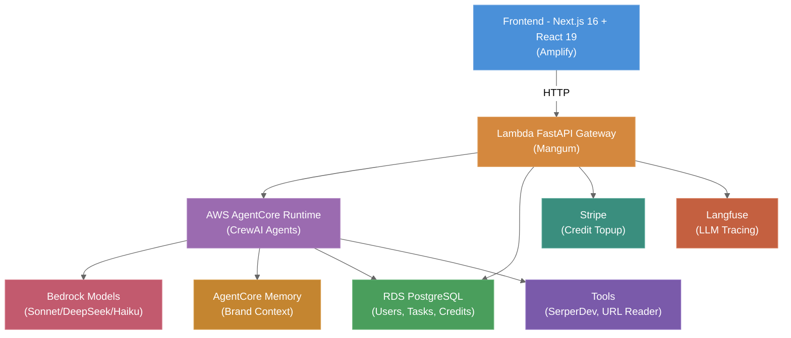

# System Architecture

**Agent Foundry** is a distributed system separating **deterministic flow** (routing, orchestration, validation) from **stochastic intelligence** (LLM reasoning within guardrails). The architecture enables agents to compose into workflows while maintaining cost control, auditability, and safety.

## Quick Navigation

- [High-Level Overview & Components](./overview.md) — System diagram, API gateway, AgentCore runtime
- [Content Editor Agent Flow](./content-editor.md) — Crew pipeline, LLM routing, memory persistence
- [API Gateway & Task Execution](./api-gateway.md) — Lambda, Logto auth, credit management, async execution
- [Data & Memory Systems](./data-memory.md) — RDS schema, AgentCore Memory, Stripe billing
- [Deployment & Infrastructure](./deployment.md) — AWS CDK stacks, cost estimates, scaling strategy

## Executive Summary

**Technology Stack:**
- **Frontend:** Next.js 16 + React 19 (deployed on Amplify)
- **API:** Lambda + FastAPI + Mangum (serverless, ARM64)
- **Agents:** CrewAI 0.80+ on AWS Bedrock AgentCore Runtime
- **LLMs:** DeepSeek V3 (reasoning), Claude Sonnet 3.5 (writing), Haiku 3.5 (scoring)
- **Data:** RDS PostgreSQL (users/billing), AgentCore Memory (brand context)
- **Observability:** Langfuse (LLM traces), CloudWatch (metrics/logs)

**Current Status (MVP — March 2026):**
- ✅ AWS AgentCore foundation deployed
- ✅ Content Editor agent (4 sub-agents) live
- ✅ API gateway with credit system operational
- ✅ Frontend (Next.js) deployed to Amplify
- 🔄 Testing & launch preparation underway

**Cost Model (5–10 users):**
- $102–260/month infrastructure (Bedrock, Lambda, RDS, Amplify)
- $0.50 per blog post (50 credits), email $0.30, social $0.20
- $5 free signup credit, Stripe topup packages

---

## System Diagrams

### High-Level Architecture

---

## Key Design Principles

1. **Serverless-First:** No long-running servers; Lambda + AgentCore handle compute
2. **Cost-Optimized:** LLM routing by task complexity (DeepSeek for reasoning, Sonnet for quality writing)
3. **Memory Persistence:** AgentCore Memory enables learning across sessions
4. **Credit-Based Billing:** Pessimistic locking prevents overages; refunds on underutilization
5. **Observability:** All LLM calls traced in Langfuse; costs tracked per agent/user/model
6. **Async Execution:** 202 Accepted pattern for long-running tasks (AgentCore jobs)

---

## Related Documents

- [Project Overview & PDR](../project-overview-pdr.md) — Functional requirements, success metrics
- [Code Standards](../code-standards.md) — Python/TypeScript conventions
- [Deployment Guide](../deployment-guide.md) — Local dev setup, production deployment
- [Codebase Summary](../codebase-summary.md) — File structure, key modules

---

## Document Metadata

- **Version:** 2.0 (AWS AgentCore Architecture)
- **Last Updated:** 2026-03-16
- **Owner:** Architecture Team
- **Status:** MVP complete; Phase 5 testing in progress
