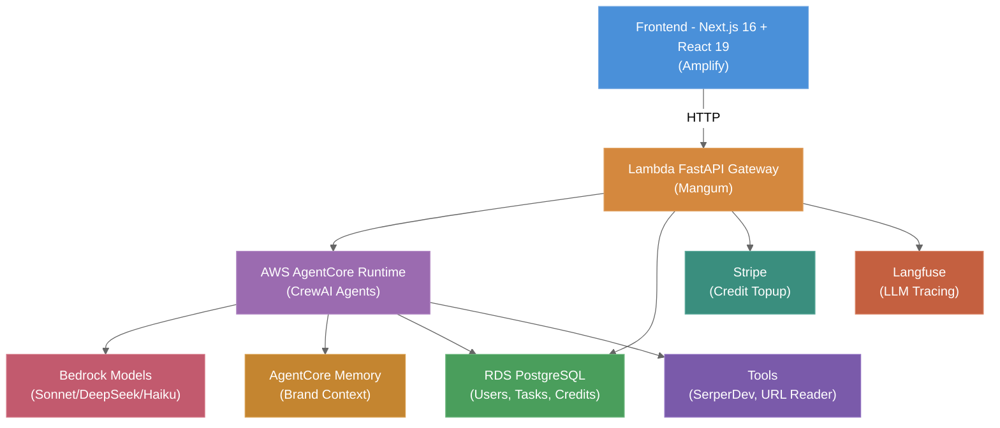

# High-Level Overview & Core Components

## System Overview

Agent Foundry's architecture separates **deterministic operations** (request routing, validation, billing) from **stochastic intelligence** (LLM reasoning within guardrails). This allows scaling each layer independently.



---

## Core Component #1: API Gateway (Lambda FastAPI + Mangum)

**Purpose:** Route requests, validate auth, invoke AgentCore, manage credits

**Responsibilities:**
- Logto Cloud OIDC authentication (JWT validation)
- Request validation (Pydantic models)
- Credit balance checking & pessimistic locking
- Task creation + async AgentCore invocation via boto3
- Credit topup (Stripe webhook integration)
- Response marshalling + error handling

**Key Routes:**
| Route | Method | Purpose |
|-------|--------|---------|
| `/api/agents` | GET | List available agents (Content Editor) |
| `/api/users/me` | GET | Authenticated user profile + credit balance |
| `/api/tasks/content` | POST | Create content task, deduct credits, invoke AgentCore (202 Accepted) |
| `/api/tasks/{id}` | GET | Task status + result |
| `/api/tasks` | GET | List user's tasks (paginated) |
| `/api/credits/topup` | POST | Create Stripe Checkout session |
| `/api/credits/webhook` | POST | Stripe webhook for credit topup completion |

**Auth Flow:**
1. Frontend redirects user to Logto sign-in
2. Logto returns user to frontend with auth code
3. Frontend obtains JWT access token from Logto
4. Subsequent API requests include Bearer JWT token
5. Lambda validates token signature via PyJWKClient (cached)

**Infrastructure:**
- AWS Lambda with Function URL
- Mangum ASGI adapter
- 512MB memory, 5-minute timeout
- Runs in same VPC as RDS (private subnet)
- No cold-start penalty for typical usage (warm containers)

**Code Location:** `backend/gateway/` (FastAPI app, routers, auth, services)

---

## Core Component #2: AgentCore Runtime (AWS Bedrock AgentCore)

**Purpose:** Execute CrewAI agents with managed Bedrock LLM access

**Responsibilities:**
- Host Content Editor CrewAI crew (4 sequential agents)
- Manage LLM invocations via native Bedrock integration
- Provide memory persistence across invocations
- Tool execution (SerperDev, URL reader)
- Monitoring + observability (OpenTelemetry)
- Cost tracking per invocation

**Architecture:**
- **Content Editor Crew:** Sequential pipeline (researcher → writer → editor → repurposer)
- **LLM Routing:** DeepSeek V3 (cheap reasoning), Sonnet (writing quality), Haiku (fast scoring)
- **Memory:** AgentCore Memory with brand voice context persistence
- **Tools:** SerperDev for web search, custom URL reader for research

**Execution Model:**
- Entry point: `@app.entrypoint` decorator on CrewAI crew execution
- Invocation: Lambda calls boto3 `invoke_agent_runtime()` with async payload
- Session management: `runtimeSessionId` parameter persists state across invocations
- Timeout: 5 minutes (configurable; hard limit enforced)

**Code Location:** `backend/agentcore/` (crews, agents, tools, models)

---

## Core Component #3: Data & State Management

### RDS PostgreSQL (Structured Data)
- **Users table:** id, logto_id, email, credit_balance_cents
- **Brand configs:** id, user_id, name, voice_yaml (YAML config)
- **Content tasks:** id, user_id, task_type, status, input_json, output_json, cost_cents
- **Credit transactions:** id, user_id, amount_cents, type (deduction/refund/topup), task_id

Indexes:
- `(user_id, created_at DESC)` on content_tasks (task history)
- `(user_id)` on brand_configs (user's brands)
- `(status)` on content_tasks (find pending tasks)

### AgentCore Memory (Brand Context Persistence)
- **Namespace:** `/brand/{user_id}/` — one memory store per user
- **Data types:** Brand voice preferences, session summaries, learning insights
- **Retrieval:** Semantic search on task start; inject brand context into agent prompts
- **Updates:** After each task, store quality score + session summary for future tasks

### Stripe (Billing)
- **Free signup credit:** $5.00 (500 cents)
- **Pricing:** Blog = 50 credits ($0.50), Email = 30 credits ($0.30), Social = 20 credits ($0.20)
- **Packages:** $10 → 1000 creds, $25 → 2750 creds, $50 → 6000 creds
- **Webhook:** Validates topup completion, credits user account

---

## Bedrock LLM Routing

**Strategy:** Cost-optimized access to Claude & DeepSeek via AWS Bedrock

| Task | Model | Use Case |
|------|-------|----------|
| **Research** | DeepSeek V3 | Factual extraction, web search analysis (cheap) |
| **Writing** | Claude Sonnet 3.5 | High-quality prose, brand voice adherence (quality-focused) |
| **Editing** | DeepSeek V3 | Rule-following, brand voice enforcement (cheap) |
| **Repurposing** | DeepSeek V3 | Template adaptation, social posts (cheap) |
| **Quality Judge** | Claude Haiku 3.5 | Structured scoring, quick feedback (fast) |

**Cost per 1M tokens:**
- DeepSeek V3: $0.27 input, $1.10 output
- Claude Haiku: $0.25 input, $1.25 output
- Claude Sonnet: $3.00 input, $15.00 output

**Bedrock Model IDs (CrewAI):**
```python
from crewai import LLM

researcher_llm = LLM(model="bedrock/deepseek.v3.2")
writer_llm = LLM(model="bedrock/anthropic.claude-3-5-sonnet-20241022-v2:0")
editor_llm = LLM(model="bedrock/deepseek.v3.2")
repurposer_llm = LLM(model="bedrock/deepseek.v3.2")
judge_llm = LLM(model="bedrock/anthropic.claude-3-5-haiku-20241022-v1:0")
```

---

## Observability & Tracing

### Langfuse (LLM Tracing)
- Captures Bedrock LLM calls, agent execution traces, token usage, costs
- Dashboard: cost breakdown per agent, per user, per model
- Integration: AgentCore exports OpenTelemetry traces

**Typical Crew Trace:**
- Researcher (1.5min): SerperDev calls, URL reading, context aggregation
- Writer (2min): High-quality blog draft
- Editor (1min): Brand voice refinement, SEO check
- Repurposer (1min): Social + email variants
- Judge (0.3min): Quality scoring

### CloudWatch Metrics
- Lambda invocations, errors, duration
- AgentCore vCPU-hours consumed
- RDS connections, CPU utilization
- Daily spend tracking (aggregate Bedrock costs)

### Application Logs
- Structured JSON: timestamp, level (DEBUG/INFO/ERROR), component, user_id, task_id, cost_cents
- Log retention: 30 days (cost control)

---

## Architecture Principles

1. **Serverless-First:** No long-running servers; Lambda + AgentCore handle compute
2. **Async Execution:** Tasks return 202 Accepted; frontend polls for completion
3. **Cost-Optimized:** LLM routing by task complexity; tracking per user, agent, model
4. **Memory-Aware:** AgentCore Memory enables learning across sessions
5. **Credit-Based Billing:** Pessimistic locking prevents overages; refunds on underutilization
6. **Observability:** All LLM calls traced; all costs tracked
7. **Security:** Logto JWT auth, Secrets Manager for credentials, VPC isolation for RDS

---

## Document Metadata

- **Version:** 2.0
- **Last Updated:** 2026-03-16
- **Owner:** Architecture Team
